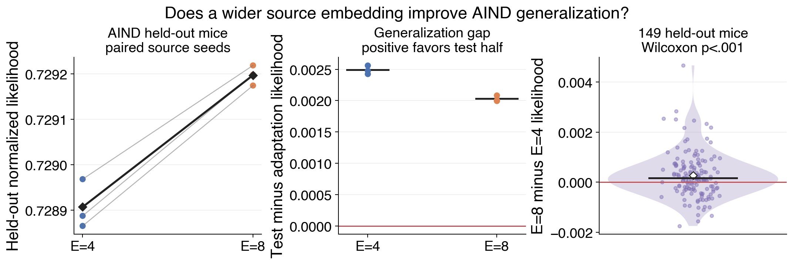
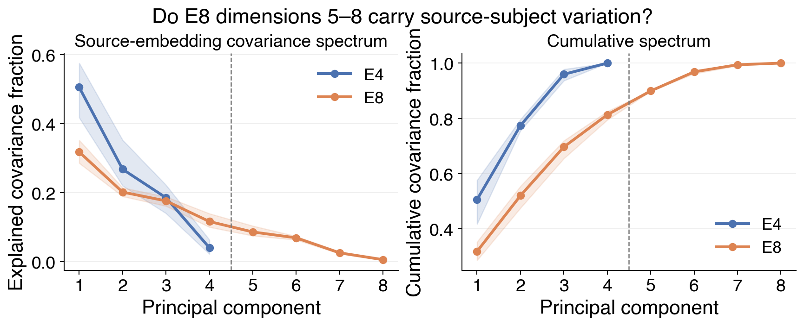

# Result 11 — is E=4 a source subject-embedding capacity bottleneck?

This report compares newly paired E=4 and E=8 GRUs trained from scratch on the
same 614 AIND source mice. The three source seeds share the `20260603` snapshot,
H=128 core, training recipe, held-out mice, adaptation protocol, and current
code. The historical E=4 result is not the primary comparator because it would
confound embedding dimension with software and execution drift.

The primary outcome is normalized likelihood on the immutable held-out half of
149 AIND mice after adapting only their subject embeddings. We also report the
test-minus-adaptation likelihood gap and the covariance spectrum across the 614
learned source embeddings. The spectrum asks whether PCs 5–8 carry variation;
it does not by itself prove that the GRU uses that variation predictively.

<!-- BEGIN result-11 -->

Thin lines pair the same source seed; black diamonds show seed means. In the subject panel, dots are held-out mice, the short bar is the median, and the hollow diamond is the mean.

Lines are the three-seed mean and ribbons span the seed range. The dashed boundary separates PCs 1–4 from the added E8 PCs 5–8.

| quantity | E=4 | E=8 | E8 minus E4 |
|---|---:|---:|---:|
| held-out likelihood, seed mean ± SD | 0.72891 ± 0.00005 | 0.72920 ± 0.00002 | +0.00029 |
| test minus adaptation likelihood | +0.00249 | +0.00203 | -0.00046 |
| source-embedding effective rank | 3.07 | 5.82 | +2.74 |
| covariance in PCs 5–8 | — | 18.7% | — |

Across 149 held-out mice, the seed-paired E8−E4 likelihood difference has median **+0.00016**, mean **+0.00027**, and two-sided Wilcoxon **p=0.000872**.

The source-data gain is statistically detectable but very small: E8 improves pooled held-out likelihood by only **+0.00029**. PCs 5–8 nevertheless carry **18.7%** of source-embedding covariance, so external transfer—not source likelihood alone—is the decisive test of whether the extra capacity is useful.
<!-- END result-11 -->

## Interpretation boundary

Embedding axes can rotate, permute, and rescale with compensating downstream
weights. We therefore interpret the covariance spectrum within each fitted
model, not individual coordinate identities or raw variance magnitudes between
E=4 and E=8. External predictive value is tested separately in Study 09.
