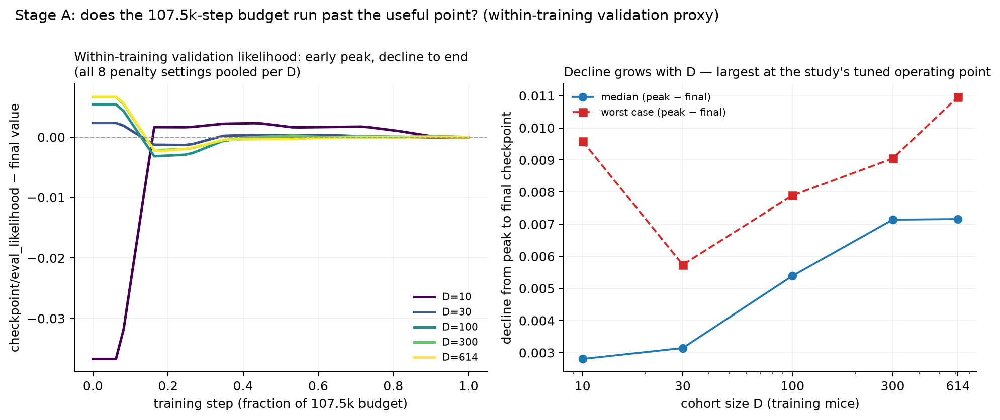

# Wave 2 — step-budget proxy + extended penalty range

Follow-on to the merged `mult-d-grid` (PR #69), motivated by two observations from that
close-out: (1) the D=614 generalization gap does not move monotonically with the tested
penalty range (lightest tested setting has the smallest gap), suggesting the grid's edge,
not interior, may be the true optimum; (2) Kevin's suggestion to treat training-step count
as a tunable.

## Stage A — step-budget proxy analysis (zero new compute, done 2026-09-09)

**What was checked.** Whether the fixed 107.5k-step training budget used throughout the
`mult-d-grid` runs off ran past the useful point, using only already-logged W&B history
(no new runs).

**Important caveat, found while doing this.** The study's held-out-across-mice metric
(`heldout/eval_likelihood`) was **only logged once, at the very end of training** (6
near-identical steps clustered in the final ~50 steps, evidently repeat eval batches for
noise-averaging, not a step-wise curve). It was **not** logged at intermediate checkpoints
in this grid, despite the wrapper config supporting it (`checkpoint_run_heldout_eval: true`
in `config_disrnn.yaml`). So the literal question "would held-out likelihood have peaked
before step 107.5k" **cannot be answered from existing data** — only a proxy is available.

**What IS available for free**: `checkpoint/eval_likelihood` — likelihood on a held-out
*session* split within the same training subjects (`eval_every_n: 2`), logged at ~12
checkpoints across the full run for all 74 analyzable finished runs. This shows a real
early-peak-then-decline pattern: for D>=30, the peak occurs at a median of ~7% of the
training budget (~step 7,500 of 107,500), and the within-training validation likelihood
then **declines** toward the final checkpoint, with the decline growing with D:

| D | median (peak − final) | worst case (peak − final) |
|---|---|---|
| 10  | +0.0028 | 0.0096 |
| 30  | +0.0031 | 0.0057 |
| 100 | +0.0054 | 0.0079 |
| 300 | +0.0071 | 0.0090 |
| 614 | +0.0072 | 0.0110 |

(D=10's curve is dominated by early-training noise rather than late-stage decline — its
median peak fraction is ~35% of the budget, not ~7% — so its numbers are not directly
comparable to D>=30's.)

**Reading.** This is suggestive, not conclusive, evidence that step count is a real lever
worth sweeping — the within-training proxy shows genuine overfitting-shaped behavior that
grows with D, right at the study's tuned operating point (D=614). But it measures overfitting
to the SAME mice's held-out sessions, not the study's actual generalization target
(held-out mice). It does not by itself tell us whether stopping earlier would improve
`heldout/eval_likelihood`.

**Action taken**: the extended-penalty-range launch in this same wave (Stage B, below) sets
`checkpoint_run_heldout_eval: true` with intermediate logging enabled, so this wave's new
runs will carry a genuine held-out-vs-step curve going forward — a real step-budget analysis
becomes possible once those runs finish, at no extra launch cost beyond wall-clock time for
the additional periodic held-out evals.

## Stage B — extended penalty range (launched 2026-09-09)

See `sweep.yaml` and `launch_record/` for the grid and provenance.
