# Result 2 — Stage-A external transfer decision report

This consolidated result compares frozen-core GRU transfer across every source D
with the matched common-Q control for all admitted cohorts. Existing author-model
results are retained where already available; the report is the stop gate before
implementing any new author-selected model.

<!-- BEGIN result-2 -->
[regenerated by `analysis/report_author_baselines.py` — do not edit by hand]

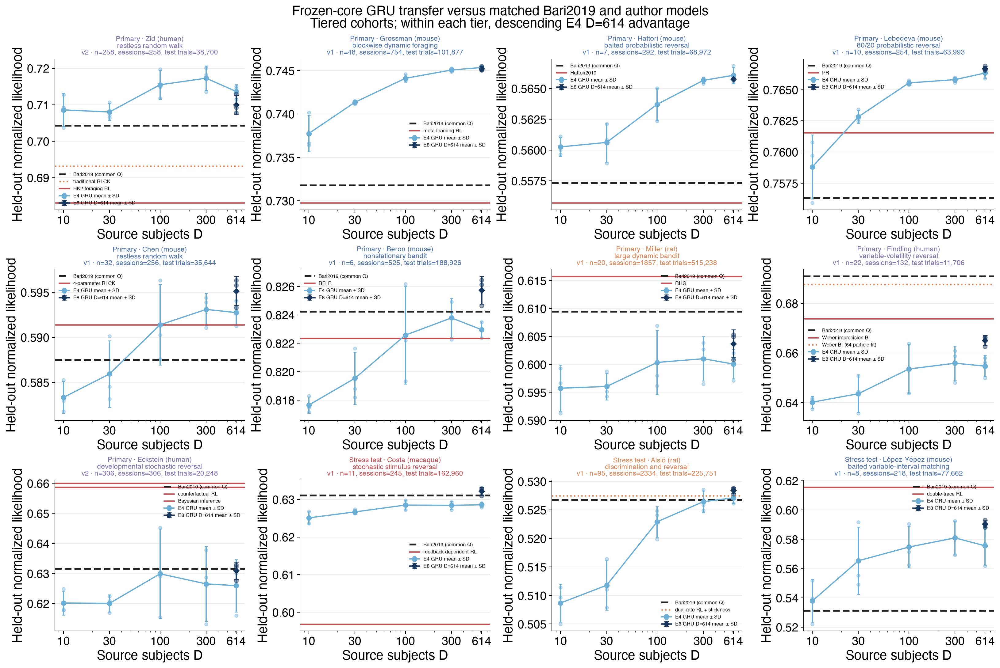

All models use the same subject-level adaptation/test split and score the exact same held-out trials. The GRU curve and table report mean ± SD across three source-training seeds at every D.

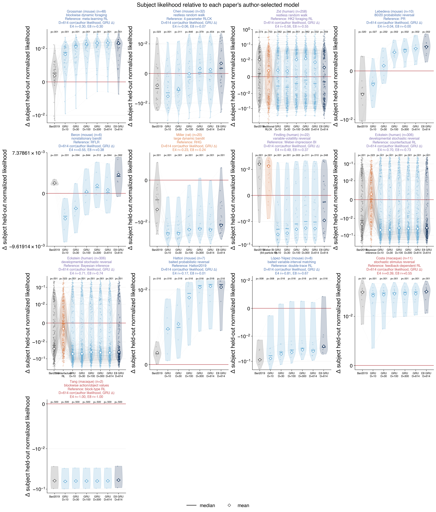

Each value is that model's subject-level normalized likelihood minus the same subject's author-selected-model likelihood. Thus the red zero line is the author-model reference; positive values favor the displayed model. Dots are subjects, thin lines connect each subject across models, violins show the distributions, the short horizontal bar is the median, and the hollow diamond is the arithmetic mean. GRU subject log likelihood is averaged across the three source seeds before conversion to normalized likelihood. Panel annotations report unadjusted two-sided paired Wilcoxon signed-rank p-values versus the author model. The panel title also reports the D=614 Pearson correlation between author-model likelihood and GRU-minus-author improvement. The symmetric-log y-axis is linear within ±0.01 and retains the large Zid outliers while resolving the central distribution.
The common Q fits five parameters: one reward learning rate, unchosen-value forgetting, one-step choice-kernel weight, side bias, and softmax inverse temperature. The `ForagerQLearning` parameter generator always adds `biasL`; the one-step kernel's step size is fixed at 1 and is not counted as a fitted parameter.

### Representative behavior sessions

These examples were selected deterministically, not by visual inspection: each category contains the three subjects at neighboring ranks around the 10th, 50th, or 90th percentile of the subject-level D=614 GRU minus author-selected-model normalized-likelihood difference. Negative values favor the author model; positive values favor the GRU.

#### Grossman mouse

##### Lower tail

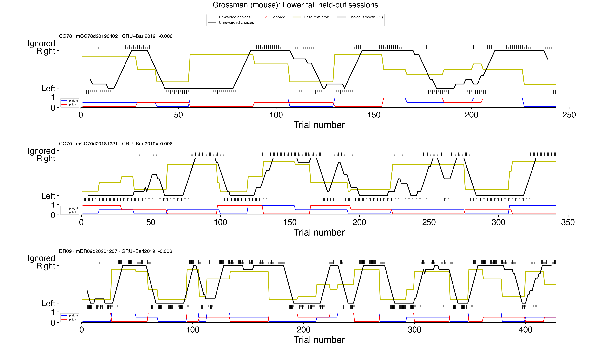

##### Median

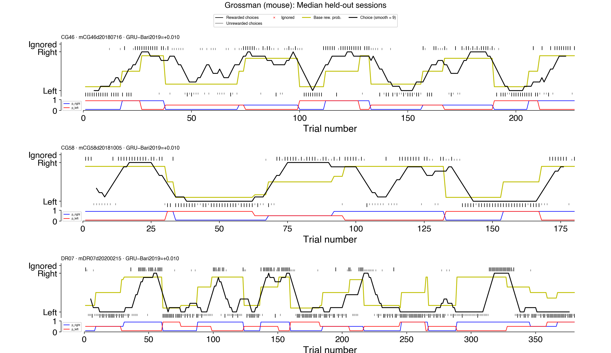

##### Upper tail

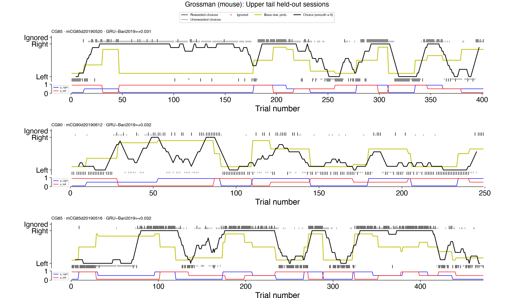

For each selected subject, the plot shows the first chronologically held-out session from the frozen odd/even session split.
Black and gray choice marks denote rewarded and unrewarded trials, the black line is the nine-trial smoothed right-choice fraction, and the lower strip shows the left/right reward probabilities.

#### Chen mouse

##### Lower tail

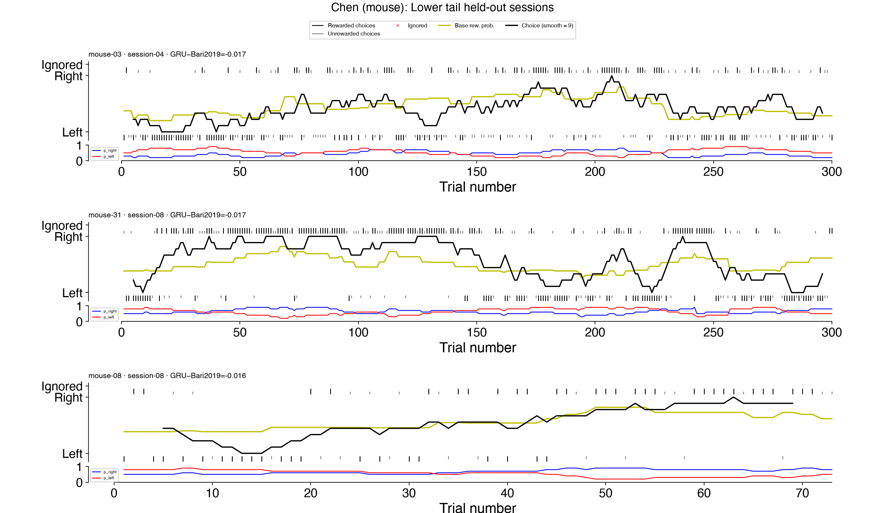

##### Median

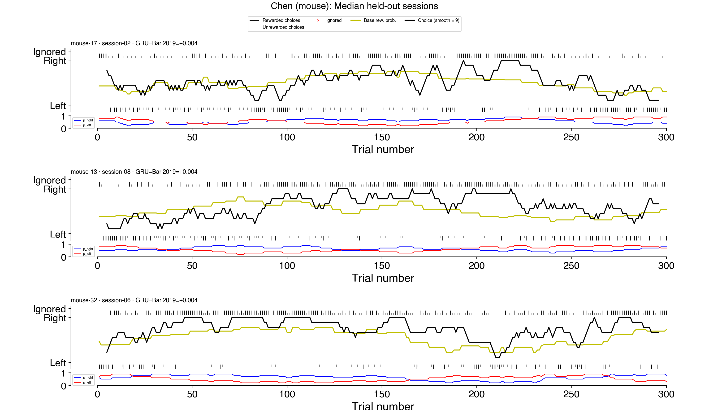

##### Upper tail

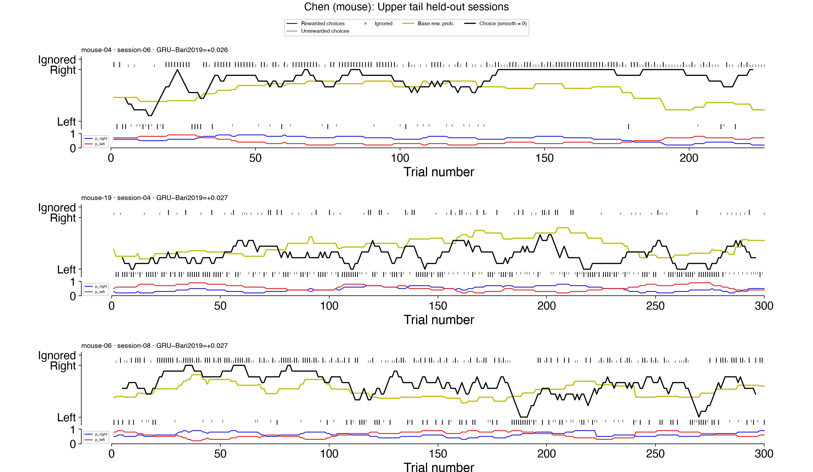

For each selected subject, the plot shows the first chronologically held-out session from the frozen odd/even session split.
Black and gray choice marks denote rewarded and unrewarded trials, the black line is the nine-trial smoothed right-choice fraction, and the lower strip shows the left/right reward probabilities.

#### Zid human

##### Lower tail

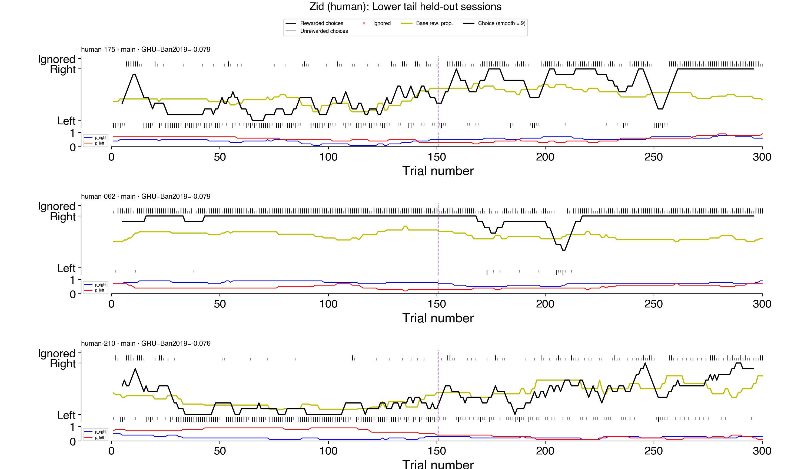

##### Median

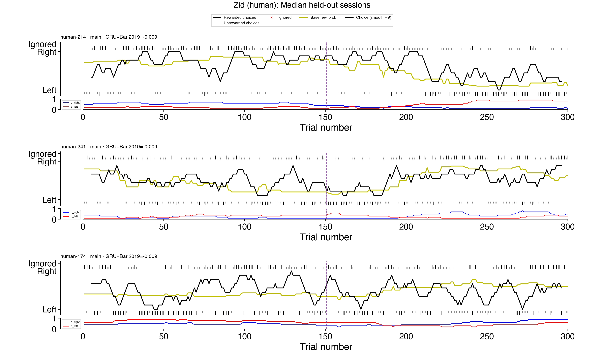

##### Upper tail

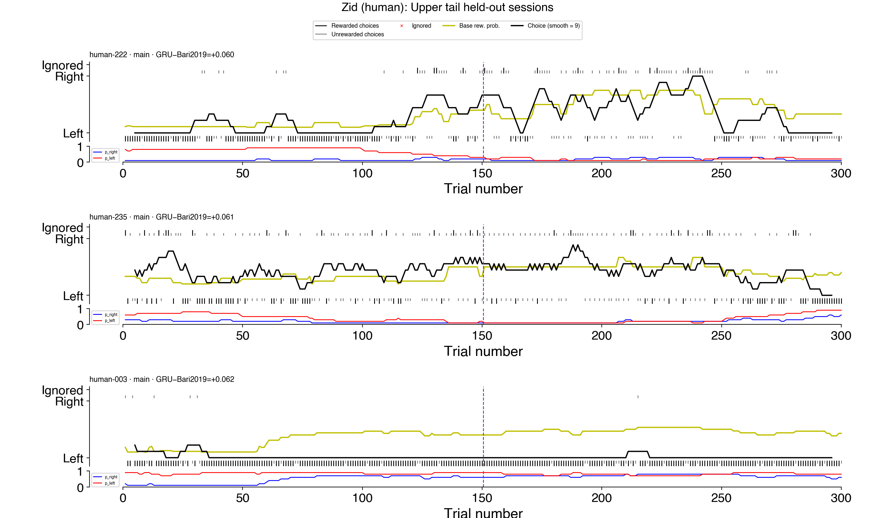

The full 300-trial session is shown; the purple dashed line separates the 150-trial adaptation prefix from the held-out suffix.
Black and gray choice marks denote rewarded and unrewarded trials, the black line is the nine-trial smoothed right-choice fraction, and the lower strip shows the left/right reward probabilities.

Plots use the pinned [`plot_foraging_session`](https://github.com/AllenNeuralDynamics/aind-dynamic-foraging-basic-analysis/blob/590e5f085711a8ba99ca0d86e94471f347318daa/src/aind_dynamic_foraging_basic_analysis/plot/plot_foraging_session.py) implementation from `aind-dynamic-foraging-basic-analysis`.

### Subject-level likelihood differences from the author model

The median uses normalized-likelihood differences shown in the figure. P-values are unadjusted two-sided paired Wilcoxon signed-rank tests against zero.

| target | author reference | comparison | median Δ likelihood | Wilcoxon p |
|---|---|---|---:|---:|
| Grossman mouse | meta-learning RL | Common Q | +0.00265 | 0.00015 |
| Grossman mouse | meta-learning RL | GRU D=10 | +0.00888 | 1.1e-10 |
| Grossman mouse | meta-learning RL | GRU D=30 | +0.01265 | 1.5e-12 |
| Grossman mouse | meta-learning RL | GRU D=100 | +0.01340 | 7.1e-14 |
| Grossman mouse | meta-learning RL | GRU D=300 | +0.01510 | 2.1e-14 |
| Grossman mouse | meta-learning RL | GRU D=614 | +0.01541 | 2.1e-14 |
| Chen mouse | 4-parameter RLCK | Common Q | -0.00504 | 0.023 |
| Chen mouse | 4-parameter RLCK | GRU D=10 | -0.00650 | 3.9e-05 |
| Chen mouse | 4-parameter RLCK | GRU D=30 | -0.00562 | 0.011 |
| Chen mouse | 4-parameter RLCK | GRU D=100 | -0.00115 | 0.85 |
| Chen mouse | 4-parameter RLCK | GRU D=300 | +0.00038 | 0.38 |
| Chen mouse | 4-parameter RLCK | GRU D=614 | +0.00045 | 0.45 |
| Zid human | HK2 foraging RL | Common Q | +0.00184 | 0.074 |
| Zid human | HK2 foraging RL | traditional RLCK | +0.00098 | 0.75 |
| Zid human | HK2 foraging RL | GRU D=10 | -0.00559 | 0.062 |
| Zid human | HK2 foraging RL | GRU D=30 | -0.00628 | 0.086 |
| Zid human | HK2 foraging RL | GRU D=100 | -0.00393 | 0.65 |
| Zid human | HK2 foraging RL | GRU D=300 | -0.00204 | 0.98 |
| Zid human | HK2 foraging RL | GRU D=614 | -0.00394 | 0.53 |

### Does GRU improvement depend on author-model fit?

Pearson r relates each subject's author-model normalized likelihood to that subject's D=614 GRU-minus-author normalized-likelihood difference. A negative value means the GRU tends to help subjects that the author-selected model fits poorly. This association is descriptive and is not an independent model-comparison test.

| target | author reference | n subjects | Pearson r |
|---|---|---:|---:|
| Grossman mouse | meta-learning RL | 48 | -0.30 |
| Chen mouse | 4-parameter RLCK | 32 | -0.06 |
| Zid human | HK2 foraging RL | 258 | -0.56 |

### Trial-pooled held-out likelihood

| target | published baseline | selected? | params | common Q | baseline | GRU D=10 | D=30 | D=100 | D=300 | D=614 |
|---|---|:---:|---:|---:|---:|---:|---:|---:|---:|---:|
| Grossman mouse | meta-learning RL | yes | 7 | 0.73177 | **0.72976** | 0.73775 ± 0.00210 | 0.74134 ± 0.00020 | 0.74410 ± 0.00042 | 0.74506 ± 0.00019 | 0.74535 ± 0.00017 |
| Chen mouse | 4-parameter RLCK | yes | 4 | 0.58747 | **0.59138** | 0.58332 ± 0.00178 | 0.58593 ± 0.00369 | 0.59139 ± 0.00448 | 0.59310 ± 0.00181 | 0.59275 ± 0.00140 |
| Zid human | traditional RLCK | no — paper comparator | 4 | 0.70427 | **0.69322** | 0.70858 ± 0.00457 | 0.70801 ± 0.00231 | 0.71547 ± 0.00399 | 0.71727 ± 0.00336 | 0.71363 ± 0.00192 |
| Zid human | HK2 foraging RL | yes | 5 | 0.70427 | **0.68306** | 0.70858 ± 0.00457 | 0.70801 ± 0.00231 | 0.71547 ± 0.00399 | 0.71727 ± 0.00336 | 0.71363 ± 0.00192 |

### Subject-balanced paired differences

Values are mean log-likelihood differences in nats/trial with 95% confidence intervals. Positive favors the model named first.

| target | published baseline | author − common Q | subjects author better | GRU D=614 − author | subjects GRU better |
|---|---|---:|---:|---:|---:|
| Grossman mouse | meta-learning RL | -0.00245 [-0.00442, -0.00048] | 19% (48) | +0.02158 [+0.01821, +0.02495] | 98% (48) |
| Chen mouse | 4-parameter RLCK | +0.00681 [+0.00163, +0.01198] | 69% (32) | +0.00228 [-0.00458, +0.00914] | 50% (32) |
| Zid human | traditional RLCK | -0.01582 [-0.03957, +0.00793] | 47% (258) | +0.02902 [-0.00599, +0.06404] | 39% (258) |
| Zid human | HK2 foraging RL | -0.03057 [-0.07337, +0.01222] | 43% (258) | +0.04378 [-0.00034, +0.08790] | 46% (258) |

### GRU versus common Q across source D

Each value is the subject-balanced GRU minus common-Q mean log likelihood in nats/trial, after averaging the GRU value across source seeds. Positive favors GRU.

| target | source D | GRU − common Q (95% CI) | subjects GRU better |
|---|---:|---:|---:|
| Grossman mouse | 10 | +0.00886 [+0.00607, +0.01165] | 90% (48) |
| Grossman mouse | 30 | +0.01345 [+0.01024, +0.01667] | 94% (48) |
| Grossman mouse | 100 | +0.01731 [+0.01350, +0.02111] | 96% (48) |
| Grossman mouse | 300 | +0.01873 [+0.01486, +0.02260] | 96% (48) |
| Grossman mouse | 614 | +0.01913 [+0.01521, +0.02305] | 96% (48) |
| Chen mouse | 10 | -0.00649 [-0.01299, +0.00002] | 31% (32) |
| Chen mouse | 30 | -0.00226 [-0.00962, +0.00510] | 56% (32) |
| Chen mouse | 100 | +0.00660 [-0.00015, +0.01334] | 66% (32) |
| Chen mouse | 300 | +0.00962 [+0.00282, +0.01641] | 78% (32) |
| Chen mouse | 614 | +0.00908 [+0.00229, +0.01588] | 75% (32) |
| Zid human | 10 | +0.00609 [-0.02140, +0.03358] | 35% (258) |
| Zid human | 30 | +0.00529 [-0.02216, +0.03274] | 38% (258) |
| Zid human | 100 | +0.01577 [-0.01119, +0.04273] | 40% (258) |
| Zid human | 300 | +0.01829 [-0.00866, +0.04523] | 40% (258) |
| Zid human | 614 | +0.01320 [-0.01398, +0.04038] | 38% (258) |

### Bottom line

- **Grossman mouse:** meta-learning RL is -0.00201 versus common Q; D=614 GRU is +0.01559 versus that published baseline.
- **Chen mouse:** 4-parameter RLCK is +0.00392 versus common Q; D=614 GRU is +0.00136 versus that published baseline.
- **Zid human:** HK2 foraging RL is -0.02121 versus common Q; D=614 GRU is +0.03057 versus that published baseline.

### Reproduction confidence

These ratings concern whether our implementation reproduces the authors' model dynamics, not uncertainty in the measured likelihood. They do not claim reproduction of the papers' reported fit values because our adaptation/test split is intentionally different.

| baseline | confidence | evidence | remaining difference from the paper |
|---|:---:|---|---|
| [Grossman meta-learning RL](https://pmc.ncbi.nlm.nih.gov/articles/PMC8825708/) | **Moderate** | Published value, expected/unexpected-uncertainty, asymmetric learning-rate, forgetting, bias, and softmax equations are implemented and covered by a hand-calculated trajectory test. | The paper did not release model code and used hierarchical session-level Stan fits with mouse-level hyperparameters and the constraint `negative-rate integration > expected-uncertainty rate`. We instead fit one parameter vector per subject by differential evolution on the adaptation sessions, without that ordering constraint. This is an equation-faithful model-family benchmark, not a reproduction of the paper's Bayesian fitting pipeline. |
| [Chen 4-parameter RLCK](https://elifesciences.org/articles/69748) | **High** | The published `alpha`, value inverse temperature, choice-kernel learning rate, and independent kernel inverse temperature map directly to our implementation; zero initialization, chosen-value update, full choice-kernel update, and policy are covered by a hand-calculated trajectory test. | We changed the fitting data and optimizer to the common matched-half protocol and have not reproduced the paper's fitted parameters or model-agreement figure from author outputs. |
| [Zid traditional RLCK](https://www.nature.com/articles/s41467-026-75773-4) (Eq. 19) | **Very high** | Initialization, value and choice-kernel updates, two inverse temperatures, policy, and bounds were checked directly against the authors' released [`model_RLchoice.m`](https://github.com/Mariemzd/HumansForageFoRwd_paper/blob/v1.0.0/modelling_matlab/model_RLchoice.m), in addition to the equation-level test. | The authors fit all 300 main trials with 20 random-start `fminsearch` fits; we fit trials 0-149 with differential evolution and score trials 150-299. |
| [Zid HK2 foraging RL](https://www.nature.com/articles/s41467-026-75773-4) (Eq. 22) | **Very high** | Exploitation value initialization at 1, reset-to-threshold only after a switch, state-history kernel, and stay policy were checked directly against the authors' released [`model_ForagingFlex.m`](https://github.com/Mariemzd/HumansForageFoRwd_paper/blob/v1.0.0/modelling_matlab/model_ForagingFlex.m) and covered by a hand-calculated trajectory test. | The same intentional matched-half and optimizer differences apply. |

Overall, confidence is high for the Chen and Zid model equations and state transitions. Confidence is only moderate for Grossman because the published Bayesian hierarchy and parameter-ordering constraint are not part of this matched subject-level baseline. Accordingly, the Grossman result should be described as a reimplementation of the selected model family, not an exact reproduction of the authors' full analysis.

### Why common Q can beat an author-selected model here

This benchmark asks which fitted model generalizes from the adaptation half to held-out data. It does **not** reproduce each paper's original model-selection objective, so a ranking reversal is not evidence that the paper's conclusion was wrong.

- **[Grossman did test Q-learning](https://pmc.ncbi.nlm.nih.gov/articles/PMC8825708/).** The paper compared meta-learning with a static-learning Q model and favored meta-learning under hierarchical session-level Stan fits and symmetric two-fold cross-validation. Our common Q is a different sticky, forgetful, side-biased model; our meta-learning fit is one vector per subject, omits the paper's hierarchy and ordering constraint, and uses only the fixed odd-session-to-even-session direction. The small common-Q trial-pooled advantage here is only 0.00201. The paired author-minus-Q difference is -0.00245 nats/trial with a 95% CI of [-0.00442, -0.00048], so the direction is fairly consistent but small. It is more plausibly a pipeline/model-specification difference than evidence that the authors never tested Q.
- **[Zid tested many traditional RL extensions](https://www.nature.com/articles/s41467-026-75773-4), but not necessarily our exact combination.** The paper selected HK2 foraging RL using fits to all 300 trials and AIC, after excluding four non-switching participants from many analyses. We combine unchosen-value decay, a one-step choice kernel, and side bias, fit only trials 0–149, score 150–299, and retain all 258 subjects. The released HK2 state dynamics match our implementation closely. Although common Q is 0.02121 higher in the trial-pooled score, the paired author-minus-Q interval [-0.07337, +0.01222] crosses zero and only 43% of subjects favor HK2. This is a heterogeneous result, more consistent with a different generalization target and fit budget than with an obvious equation bug.

The conservative claim is therefore: **common Q generalizes better than these author-model refits under our matched held-out protocol in Grossman and Zid**. It is not a paper-level reproduction claim. Stronger attribution would require reproducing Grossman's hierarchy and both fold directions, plus Zid's full-data AIC ranking and 254-subject analysis subset.

### Verification

- Each published baseline was fitted independently per subject on the adaptation half; no paper-reported likelihood was copied.
- Published-baseline, common-Q, and GRU prediction files have identical ordered `(subject, session, trial, choice)` keys within each target dataset.
- Grossman and Chen use odd-positioned sessions for adaptation and even-positioned sessions for test. Zid adapts on trials 0–149 and scores trials 150–299 after state-only prefix replay.
- The Grossman, Chen, and selected Zid implementations follow the authors' published update equations; Zid traditional RLCK is retained as the paper's simpler comparator.
- Nominal source D is plotted. Realized source-subject counts were D=10: [10], D=30: [29, 30], D=100: [99, 101], D=300: [300, 301], D=614: [614].
- Common Q and each author model have one fitted baseline per target dataset and therefore no source-training-seed error bar.
<!-- END result-2 -->

## Interpretation

These are refits on our matched split, not copied likelihoods from the papers. That keeps test
trials, information budget, scoring, and subject-level fitting identical across model families.
