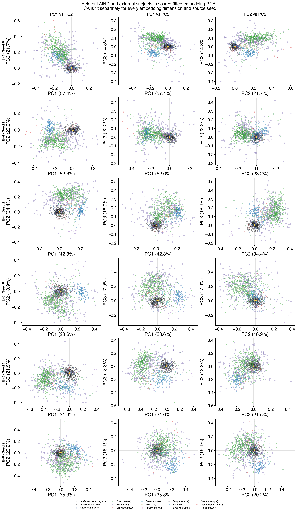
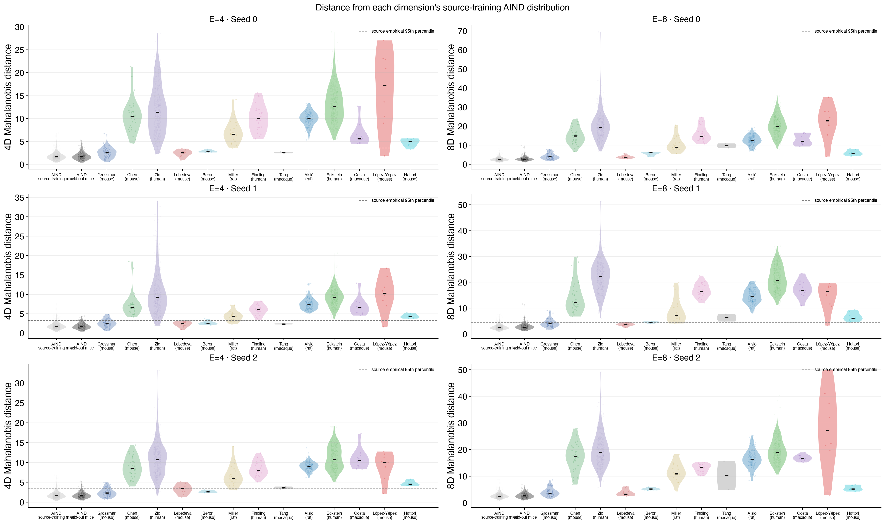

# Result 2: where transferred subjects land in the GRU embedding space

This result asks where unseen held-out AIND mice and every admitted external
two-arm-bandit cohort land in the subject-embedding manifold learned from the
614 source mice.

<!-- BEGIN result-2 -->
## Result



The primary comparison is **held-out AIND mice versus external subjects**, shown
separately for E=4 and E=8. All of
these subjects were unseen during GRU-core training, initialized at the source
embedding mean, and adapted for the same 500 steps at learning rate 0.001 while
the core remained frozen. The 614 source-training mice define the coordinate
system but are not treated as the transfer control.

Kwak (mouse) is omitted. Its frozen embedding was adapted on CNO sessions and
evaluated on DMSO sessions, so it does not estimate within-condition subject
transfer. It will be readmitted only after a DMSO/control-only odd/even-session
rerun.

PCA is fit independently for every embedding dimension and source seed; raw
coordinates are never pooled across seeds or dimensions. The first three PCs
explain E=4: 93.4%–98.0%; E=8: 65.5%–71.9% of source variance. The
star is the common initialization point and the dashed ellipse is the Gaussian
95% source contour in each displayed projection.



The Mahalanobis analysis uses all available dimensions—4D for E=4 and 8D for
E=8—and each seed's source covariance. External median distance exceeds the
held-out-AIND median in:

- **E=4:** Grossman (mouse) (3/3 seeds); Chen (mouse) (3/3 seeds); Zid (human) (3/3 seeds); Lebedeva (mouse) (3/3 seeds); Beron (mouse) (3/3 seeds); Miller (rat) (3/3 seeds); Findling (human) (3/3 seeds); Tang (macaque) (3/3 seeds); Alsiö (rat) (3/3 seeds); Eckstein (human) (3/3 seeds); Costa (macaque) (3/3 seeds); López-Yépez (mouse) (3/3 seeds); Hattori (mouse) (3/3 seeds)
- **E=8:** Grossman (mouse) (3/3 seeds); Chen (mouse) (3/3 seeds); Zid (human) (3/3 seeds); Lebedeva (mouse) (3/3 seeds); Beron (mouse) (3/3 seeds); Miller (rat) (3/3 seeds); Findling (human) (3/3 seeds); Tang (macaque) (3/3 seeds); Alsiö (rat) (3/3 seeds); Eckstein (human) (3/3 seeds); Costa (macaque) (3/3 seeds); López-Yépez (mouse) (3/3 seeds); Hattori (mouse) (3/3 seeds)

| space | seed | population | species | n | median distance | centroid distance | outside source 95% |
|---|---:|---|---|---:|---:|---:|---:|
| E=4 | 0 | AIND held-out mice | mouse | 149 | 1.67 | 0.07 | 5.4% |
| E=4 | 0 | Grossman (mouse) | mouse | 48 | 2.56 | 0.61 | 14.6% |
| E=4 | 0 | Chen (mouse) | mouse | 32 | 10.51 | 8.76 | 100.0% |
| E=4 | 0 | Zid (human) | human | 258 | 11.38 | 7.84 | 97.3% |
| E=4 | 0 | Lebedeva (mouse) | mouse | 10 | 2.54 | 1.88 | 0.0% |
| E=4 | 0 | Beron (mouse) | mouse | 6 | 2.82 | 2.64 | 0.0% |
| E=4 | 0 | Miller (rat) | rat | 20 | 6.62 | 6.83 | 95.0% |
| E=4 | 0 | Findling (human) | human | 22 | 10.04 | 9.72 | 100.0% |
| E=4 | 0 | Tang (macaque) | macaque | 2 | 2.59 | 2.57 | 0.0% |
| E=4 | 0 | Alsiö (rat) | rat | 95 | 10.09 | 9.42 | 100.0% |
| E=4 | 0 | Eckstein (human) | human | 306 | 12.64 | 12.16 | 100.0% |
| E=4 | 0 | Costa (macaque) | macaque | 11 | 5.58 | 6.08 | 100.0% |
| E=4 | 0 | López-Yépez (mouse) | mouse | 8 | 17.24 | 15.34 | 87.5% |
| E=4 | 0 | Hattori (mouse) | mouse | 7 | 5.00 | 4.56 | 85.7% |
| E=4 | 1 | AIND held-out mice | mouse | 149 | 1.67 | 0.14 | 5.4% |
| E=4 | 1 | Grossman (mouse) | mouse | 48 | 2.45 | 0.60 | 22.9% |
| E=4 | 1 | Chen (mouse) | mouse | 32 | 6.56 | 5.54 | 100.0% |
| E=4 | 1 | Zid (human) | human | 258 | 9.27 | 5.68 | 97.3% |
| E=4 | 1 | Lebedeva (mouse) | mouse | 10 | 2.41 | 1.69 | 0.0% |
| E=4 | 1 | Beron (mouse) | mouse | 6 | 2.50 | 2.36 | 16.7% |
| E=4 | 1 | Miller (rat) | rat | 20 | 4.36 | 4.28 | 75.0% |
| E=4 | 1 | Findling (human) | human | 22 | 6.15 | 5.60 | 100.0% |
| E=4 | 1 | Tang (macaque) | macaque | 2 | 2.35 | 2.33 | 0.0% |
| E=4 | 1 | Alsiö (rat) | rat | 95 | 7.43 | 6.53 | 100.0% |
| E=4 | 1 | Eckstein (human) | human | 306 | 9.23 | 8.22 | 100.0% |
| E=4 | 1 | Costa (macaque) | macaque | 11 | 6.51 | 6.59 | 100.0% |
| E=4 | 1 | López-Yépez (mouse) | mouse | 8 | 10.33 | 9.30 | 87.5% |
| E=4 | 1 | Hattori (mouse) | mouse | 7 | 4.24 | 4.27 | 100.0% |
| E=4 | 2 | AIND held-out mice | mouse | 149 | 1.62 | 0.09 | 4.0% |
| E=4 | 2 | Grossman (mouse) | mouse | 48 | 2.31 | 0.53 | 20.8% |
| E=4 | 2 | Chen (mouse) | mouse | 32 | 8.45 | 7.07 | 100.0% |
| E=4 | 2 | Zid (human) | human | 258 | 10.74 | 7.75 | 98.1% |
| E=4 | 2 | Lebedeva (mouse) | mouse | 10 | 3.39 | 2.90 | 50.0% |
| E=4 | 2 | Beron (mouse) | mouse | 6 | 2.59 | 2.46 | 0.0% |
| E=4 | 2 | Miller (rat) | rat | 20 | 6.05 | 6.61 | 95.0% |
| E=4 | 2 | Findling (human) | human | 22 | 8.00 | 8.29 | 100.0% |
| E=4 | 2 | Tang (macaque) | macaque | 2 | 3.61 | 3.54 | 50.0% |
| E=4 | 2 | Alsiö (rat) | rat | 95 | 9.12 | 8.28 | 100.0% |
| E=4 | 2 | Eckstein (human) | human | 306 | 10.72 | 10.27 | 100.0% |
| E=4 | 2 | Costa (macaque) | macaque | 11 | 10.44 | 10.19 | 100.0% |
| E=4 | 2 | López-Yépez (mouse) | mouse | 8 | 10.06 | 8.97 | 87.5% |
| E=4 | 2 | Hattori (mouse) | mouse | 7 | 4.56 | 4.52 | 100.0% |
| E=8 | 0 | AIND held-out mice | mouse | 149 | 2.70 | 0.41 | 7.4% |
| E=8 | 0 | Grossman (mouse) | mouse | 48 | 4.06 | 1.01 | 31.2% |
| E=8 | 0 | Chen (mouse) | mouse | 32 | 14.85 | 11.35 | 100.0% |
| E=8 | 0 | Zid (human) | human | 258 | 19.37 | 13.83 | 100.0% |
| E=8 | 0 | Lebedeva (mouse) | mouse | 10 | 3.77 | 2.87 | 20.0% |
| E=8 | 0 | Beron (mouse) | mouse | 6 | 6.18 | 5.38 | 83.3% |
| E=8 | 0 | Miller (rat) | rat | 20 | 8.98 | 10.16 | 100.0% |
| E=8 | 0 | Findling (human) | human | 22 | 14.63 | 15.06 | 100.0% |
| E=8 | 0 | Tang (macaque) | macaque | 2 | 9.76 | 9.64 | 100.0% |
| E=8 | 0 | Alsiö (rat) | rat | 95 | 12.55 | 11.27 | 100.0% |
| E=8 | 0 | Eckstein (human) | human | 306 | 19.78 | 17.46 | 100.0% |
| E=8 | 0 | Costa (macaque) | macaque | 11 | 12.09 | 10.48 | 100.0% |
| E=8 | 0 | López-Yépez (mouse) | mouse | 8 | 22.87 | 18.89 | 87.5% |
| E=8 | 0 | Hattori (mouse) | mouse | 7 | 5.72 | 4.87 | 85.7% |
| E=8 | 1 | AIND held-out mice | mouse | 149 | 2.66 | 0.33 | 6.7% |
| E=8 | 1 | Grossman (mouse) | mouse | 48 | 3.95 | 1.00 | 33.3% |
| E=8 | 1 | Chen (mouse) | mouse | 32 | 12.27 | 9.53 | 100.0% |
| E=8 | 1 | Zid (human) | human | 258 | 22.33 | 14.43 | 100.0% |
| E=8 | 1 | Lebedeva (mouse) | mouse | 10 | 3.68 | 2.98 | 20.0% |
| E=8 | 1 | Beron (mouse) | mouse | 6 | 4.57 | 4.29 | 66.7% |
| E=8 | 1 | Miller (rat) | rat | 20 | 7.13 | 8.09 | 95.0% |
| E=8 | 1 | Findling (human) | human | 22 | 16.50 | 15.94 | 100.0% |
| E=8 | 1 | Tang (macaque) | macaque | 2 | 6.27 | 5.75 | 100.0% |
| E=8 | 1 | Alsiö (rat) | rat | 95 | 14.51 | 13.43 | 100.0% |
| E=8 | 1 | Eckstein (human) | human | 306 | 20.70 | 18.25 | 100.0% |
| E=8 | 1 | Costa (macaque) | macaque | 11 | 16.84 | 14.81 | 100.0% |
| E=8 | 1 | López-Yépez (mouse) | mouse | 8 | 16.48 | 10.44 | 87.5% |
| E=8 | 1 | Hattori (mouse) | mouse | 7 | 6.14 | 6.13 | 100.0% |
| E=8 | 2 | AIND held-out mice | mouse | 149 | 2.65 | 0.27 | 6.0% |
| E=8 | 2 | Grossman (mouse) | mouse | 48 | 3.65 | 0.67 | 29.2% |
| E=8 | 2 | Chen (mouse) | mouse | 32 | 17.46 | 14.43 | 100.0% |
| E=8 | 2 | Zid (human) | human | 258 | 18.94 | 11.48 | 100.0% |
| E=8 | 2 | Lebedeva (mouse) | mouse | 10 | 3.28 | 2.64 | 20.0% |
| E=8 | 2 | Beron (mouse) | mouse | 6 | 5.19 | 4.80 | 100.0% |
| E=8 | 2 | Miller (rat) | rat | 20 | 10.87 | 11.02 | 95.0% |
| E=8 | 2 | Findling (human) | human | 22 | 13.37 | 12.13 | 100.0% |
| E=8 | 2 | Tang (macaque) | macaque | 2 | 10.28 | 9.80 | 100.0% |
| E=8 | 2 | Alsiö (rat) | rat | 95 | 16.38 | 15.04 | 100.0% |
| E=8 | 2 | Eckstein (human) | human | 306 | 19.06 | 14.99 | 100.0% |
| E=8 | 2 | Costa (macaque) | macaque | 11 | 16.63 | 15.88 | 100.0% |
| E=8 | 2 | López-Yépez (mouse) | mouse | 8 | 27.23 | 26.07 | 87.5% |
| E=8 | 2 | Hattori (mouse) | mouse | 7 | 5.23 | 4.76 | 85.7% |

## Cross-dimension read

Raw coordinates and distance magnitudes are not directly comparable between E=4
and E=8 because the spaces have different dimensionality and independently
learned axes. The meaningful comparison is whether the **within-space cohort
ordering** and downstream performance relationships are stable. The E4/E8 rank
correlation across the 13 cohorts is **+0.923**.

| cohort | E4 mean median distance | E4 rank | E8 mean median distance | E8 rank |
|---|---:|---:|---:|---:|
| Grossman (mouse) | 2.44 | 1 | 3.89 | 2 |
| Beron (mouse) | 2.64 | 2 | 5.31 | 3 |
| Lebedeva (mouse) | 2.78 | 3 | 3.58 | 1 |
| Tang (macaque) | 2.85 | 4 | 8.77 | 5 |
| Hattori (mouse) | 4.60 | 5 | 5.70 | 4 |
| Miller (rat) | 5.67 | 6 | 8.99 | 6 |
| Costa (macaque) | 7.51 | 7 | 15.19 | 10 |
| Findling (human) | 8.06 | 8 | 14.83 | 8 |
| Chen (mouse) | 8.51 | 9 | 14.86 | 9 |
| Alsiö (rat) | 8.88 | 10 | 14.48 | 7 |
| Zid (human) | 10.46 | 11 | 20.21 | 12 |
| Eckstein (human) | 10.87 | 12 | 19.85 | 11 |
| López-Yépez (mouse) | 12.54 | 13 | 22.19 | 13 |

This ordering is descriptive. Species, task schedule, reward contingencies,
recording duration, and adaptation-data volume change together across these
datasets, so distance cannot be interpreted as a pure species effect. Proximity
means the frozen core can express a target near the coordinates used by new
in-distribution mice; distance does not by itself imply poor prediction.

## Reproduce

The committed E4 and E8 JSON files contain every embedding plus SHA-256 digests
of the downloaded embedding tables, subject maps, and adaptation summaries.
Regenerate both figures and this report offline with:

```bash
make r2
```
<!-- END result-2 -->
