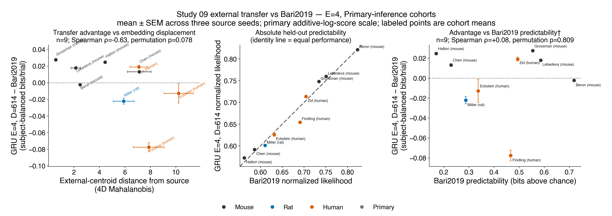
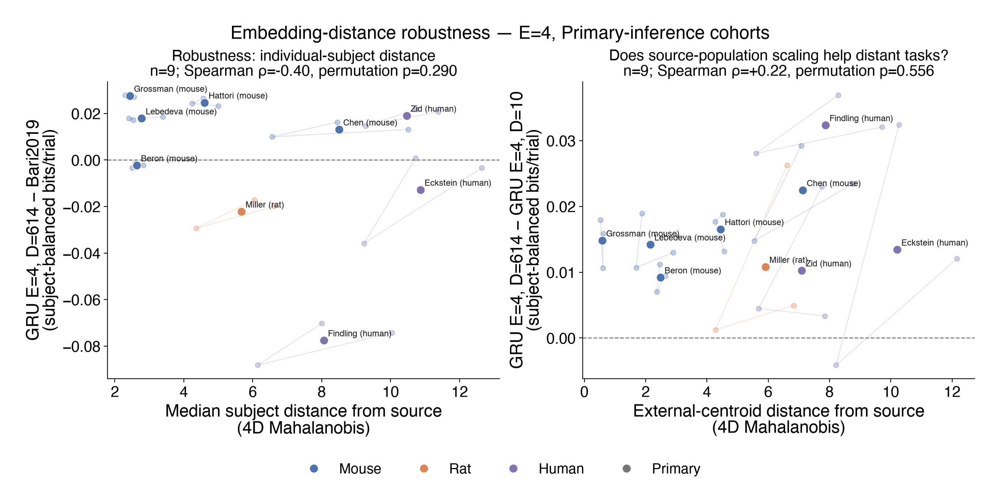
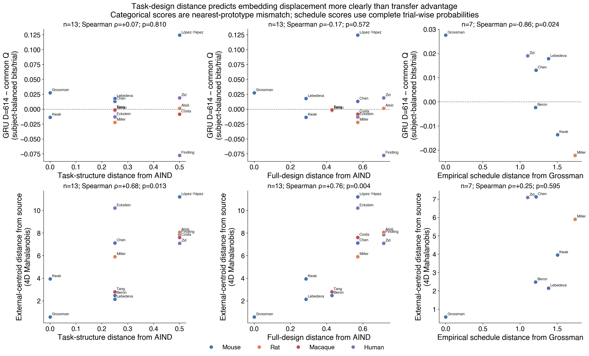

# Result 3 — what predicts external GRU transfer?

This result relates D=614 GRU improvement over the matched common-Q baseline to
external-cohort embedding displacement, baseline predictability, an auditable
categorical task-design matrix, and empirical reward-schedule distance. It uses
all 13 frozen Stage-A cohorts for categorical analyses and the seven cohorts
with complete trial-wise arm probabilities for schedule analyses.

<!-- BEGIN result-3 -->
[regenerated by `analysis/report_generalization_drivers.py` — do not edit by hand]

## First-pass result



Each cohort is one equal-weight cross-study unit. Performance is the arithmetic mean held-out log likelihood across subjects, converted to bits per trial. Embedding distance is calculated in the full four-dimensional space, separately for each source seed. Large labeled points average the three paired seeds; small points show the seed-specific values. Species is descriptive rather than an inferential grouping because species, study, and task design are confounded.

The D=614 GRU has higher subject-balanced mean log likelihood than common Q in 6 cohorts (Grossman, Chen, Zid, Lebedeva, Alsiö, López-Yépez) and lower mean log likelihood in 7 (Beron, Kwak, Miller, Findling, Tang, Eckstein, Costa). This direction summary does not replace the paired subject tests in Result 1.

The additive log-score estimand is primary for cross-task comparison. Zid is the only direction reversal under the mean subject normalized-likelihood difference: its log-score difference is positive, whereas its mean normalized-likelihood difference is negative, consistent with Result 1. Both values are retained below.

Across the 13 cohort means, GRU advantage and embedding-centroid distance have Spearman ρ=-0.126 (bootstrap 95% CI [-0.77, +0.52]; two-sided permutation p=0.6828). The leave-one-cohort-out range is [-0.43, +0.03].

The identity plot is the primary view of baseline predictability. The right panel shows the requested GRU-minus-Q value against common Q, but its correlation is mathematically coupled because Q appears on both axes. It is therefore descriptive, even though its observed ρ is -0.066.



Median individual-subject embedding distance tests whether the centroid result is hiding a dispersed or bimodal cohort. The scaling panel asks whether increasing the source population from D=10 to D=614 helps cohorts that land farther from the source embedding distribution. Its cross-cohort Spearman ρ is +0.599 (permutation p=0.0333).

### Cohort estimates

| cohort | species | subjects | common Q likelihood | GRU614 likelihood | GRU614−Q bits/trial | mean subject Δ likelihood | centroid distance | median subject distance | GRU614−GRU10 bits/trial |
|---|---|---:|---:|---:|---:|---:|---:|---:|---:|
| Grossman | mouse | 48 | 0.7341 | 0.7483 | +0.0276 | +0.0139 | 0.58 | 2.44 | +0.0148 |
| Chen | mouse | 32 | 0.5861 | 0.5914 | +0.0131 | +0.0053 | 7.13 | 8.51 | +0.0225 |
| Zid | human | 258 | 0.7043 | 0.7136 | +0.0190 | -0.0015 | 7.09 | 10.46 | +0.0103 |
| Lebedeva | mouse | 10 | 0.7507 | 0.7600 | +0.0179 | +0.0094 | 2.15 | 2.78 | +0.0142 |
| Beron | mouse | 6 | 0.8227 | 0.8214 | -0.0023 | -0.0013 | 2.49 | 2.64 | +0.0092 |
| Kwak | mouse | 39 | 0.6276 | 0.6217 | -0.0136 | -0.0059 | 3.95 | 3.93 | +0.0042 |
| Miller | rat | 20 | 0.6104 | 0.6011 | -0.0222 | -0.0093 | 5.91 | 5.67 | +0.0108 |
| Findling | human | 22 | 0.6907 | 0.6546 | -0.0776 | -0.0372 | 7.87 | 8.06 | +0.0323 |
| Tang | macaque | 2 | 0.5547 | 0.5542 | -0.0012 | -0.0005 | 2.81 | 2.85 | +0.0052 |
| Alsiö | rat | 95 | 0.5297 | 0.5303 | +0.0015 | +0.0007 | 8.08 | 8.88 | +0.0510 |
| Eckstein | human | 306 | 0.6315 | 0.6259 | -0.0128 | -0.0180 | 10.21 | 10.87 | +0.0134 |
| Costa | macaque | 11 | 0.5865 | 0.5832 | -0.0083 | -0.0036 | 7.62 | 7.51 | +0.0347 |
| López-Yépez | mouse | 8 | 0.5272 | 0.5747 | +0.1243 | +0.0472 | 11.21 | 12.54 | +0.0976 |

Normalized likelihoods in this table are `exp(mean subject log likelihood)`, not trial-pooled values. This prevents large cohorts or long sessions from dominating a cross-study comparison.

### Cross-cohort sensitivity

| relationship | Spearman ρ | cohort-bootstrap 95% CI | permutation p | leave-one-cohort-out ρ |
|---|---:|---:|---:|---:|
| GRU614−Q vs embedding centroid distance | -0.126 | [-0.77, +0.52] | 0.6828 | [-0.43, +0.03] |
| GRU614−Q vs median subject embedding distance | +0.077 | [-0.63, +0.71] | 0.8066 | [-0.17, +0.29] |
| GRU614−Q vs common-Q predictability† | -0.066 | [-0.70, +0.55] | 0.8332 | [-0.22, +0.19] |
| GRU614−GRU10 vs embedding centroid distance | +0.599 | [-0.01, +0.93] | 0.0333 | [+0.49, +0.71] |

† The common-Q relationship shares Q between the horizontal axis and the GRU-minus-Q vertical axis. Its correlation is not an independent test of whether intrinsically easier tasks transfer better.

## Task-design meta-analysis



The categorical analysis is outcome-blind. Task-structure distance is the equal-weight mismatch over schedule family, arm coupling, baiting, and what the subject chooses. Full-design distance adds physical context, response modality, and reward modality. Each cohort is scored against the nearest of the three task prototypes actually represented in the AIND source-training snapshot; this preserves source heterogeneity and makes Grossman a zero-distance anchor.

Task-structure distance is associated with adapted embedding-centroid displacement (ρ=+0.684, permutation p=0.0127) but not with GRU advantage (ρ=+0.075, p=0.8097). The same separation is stronger for the full-design score: embedding ρ=+0.758 (p=0.0036), versus GRU advantage ρ=-0.171 (p=0.5719). Thus the transferred embedding geometry carries an auditable task/apparatus-distance signal, but categorical closeness alone does not explain whether GRU beats common Q.

### Species-stratified description

| species | cohorts | mean GRU614−Q bits/trial | median | range | mean embedding distance | mean task distance |
|---|---:|---:|---:|---:|---:|---:|
| Mouse | 6 | +0.0278 | +0.0155 | [-0.0136, +0.1243] | 4.58 | 0.21 |
| Rat | 2 | -0.0103 | -0.0103 | [-0.0222, +0.0015] | 6.99 | 0.38 |
| Macaque | 2 | -0.0047 | -0.0047 | [-0.0083, -0.0012] | 5.22 | 0.38 |
| Human | 3 | -0.0238 | -0.0128 | [-0.0776, +0.0190] | 8.39 | 0.42 |

These are equal-cohort descriptive summaries, not species effects. Each species is represented by only two to six studies, and task design differs systematically by species. In particular, a species contrast would currently relabel the same design and apparatus contrasts rather than isolate biology.

For the seven cohorts whose canonical adapters expose complete trial-wise probabilities for both arms, empirical schedule distance from Grossman is negatively associated with GRU advantage (ρ=-0.857, exact permutation p=0.0238; bootstrap 95% CI [-1.00, +0.07]; leave-one-out range [-0.94, -0.77]). Its association with embedding-centroid distance is weak (ρ=+0.250, p=0.5948). The performance result is promising but small-sample: the bootstrap interval crosses zero, and Grossman defines the schedule-distance origin.

### Evidence-backed categorical matrix

| cohort | species | schedule | coupling | baited | choice target | context | response | reward | task distance | full distance |
|---|---|---|---|---|---|---|---|---|---:|---:|
| [Grossman](https://pmc.ncbi.nlm.nih.gov/articles/PMC8825708/) | mouse | blockwise | independent | no | spatial action | head fixed | lick | water | 0.00 | 0.00 |
| [Chen](https://pmc.ncbi.nlm.nih.gov/articles/PMC8794469/) | mouse | random walk | independent | no | spatial action | freely moving | nose poke | liquid food | 0.25 | 0.57 |
| [Zid](https://www.nature.com/articles/s41467-026-75773-4) | human | random walk | independent | no | abstract option | online | computer input | monetary points | 0.50 | 0.71 |
| [Lebedeva](https://www.nature.com/articles/s41467-026-71664-w) | mouse | blockwise | coupled | no | spatial action | head fixed | wheel | water | 0.25 | 0.29 |
| [Beron](https://pmc.ncbi.nlm.nih.gov/articles/PMC9169659/) | mouse | blockwise | coupled | no | spatial action | freely moving | nose poke | water | 0.25 | 0.43 |
| [Kwak](https://pmc.ncbi.nlm.nih.gov/articles/PMC6658164/) | mouse | blockwise | independent | no | spatial action | freely moving | nose poke | water | 0.00 | 0.29 |
| [Miller](https://www.biorxiv.org/content/10.1101/461129v3) | rat | random walk | independent | no | spatial action | freely moving | nose poke | liquid food | 0.25 | 0.57 |
| [Findling](https://pmc.ncbi.nlm.nih.gov/articles/PMC12728203/) | human | blockwise | coupled | no | visual stimulus | laboratory | handheld button | monetary points | 0.50 | 0.71 |
| [Tang](https://pmc.ncbi.nlm.nih.gov/articles/PMC7873307/) | macaque | blockwise | coupled | no | spatial action, visual stimulus | head fixed | saccade | juice | 0.25 | 0.43 |
| [Alsiö](https://pmc.ncbi.nlm.nih.gov/articles/PMC6695374/) | rat | criterion reversal | coupled | no | spatial action, visual stimulus | freely moving | touchscreen | food pellet | 0.50 | 0.71 |
| [Eckstein](https://pmc.ncbi.nlm.nih.gov/articles/PMC9108470/) | human | blockwise | coupled | no | spatial action | laboratory | keyboard | monetary points | 0.25 | 0.57 |
| [Costa](https://pmc.ncbi.nlm.nih.gov/articles/PMC5074688/) | macaque | blockwise | coupled | no | visual stimulus | head fixed | saccade | juice | 0.50 | 0.57 |
| [López-Yépez](https://doi.org/10.1371/journal.pcbi.1009452) | mouse | variable interval | choice dependent | yes | spatial action | freely moving | nose poke | water | 0.50 | 0.57 |

Cohort names link to the primary Methods source used for annotation. The complete evidence note for every row, the three AIND prototypes, and the scoring contract are frozen in `analysis/task_design_features.json`.

### Empirical reward-schedule features

| cohort | arm lag-1 | gap lag-1 | cross-arm | change rate | step size | mean abs(gap) | mean p(reward) | equal-p fraction | distance to Grossman |
|---|---:|---:|---:|---:|---:|---:|---:|---:|---:|
| Grossman | 0.950 | 0.953 | -0.375 | 0.053 | 0.555 | 0.471 | 0.508 | 0.170 | 0.00 |
| Chen | 0.978 | 0.984 | -0.460 | 0.153 | 0.102 | 0.285 | 0.560 | 0.111 | 1.21 |
| Zid | 0.973 | 0.975 | -0.022 | 0.170 | 0.100 | 0.306 | 0.508 | 0.100 | 1.10 |
| Lebedeva | 0.987 | 0.987 | -1.000 | 0.006 | 0.600 | 0.600 | 0.500 | 0.000 | 1.38 |
| Beron | 0.960 | 0.960 | -1.000 | 0.020 | 0.580 | 0.580 | 0.500 | 0.000 | 1.21 |
| Kwak | 0.961 | 0.961 | -1.000 | 0.020 | 0.600 | 0.600 | 0.420 | 0.000 | 1.50 |
| Miller | 0.917 | 0.917 | 0.003 | 0.992 | 0.111 | 0.381 | 0.496 | 0.017 | 1.74 |

Every metric is computed using only within-session transitions. Subjects are summarized first and then averaged equally within a cohort. The composite distance is the root-mean-square standardized Euclidean distance across seven predeclared features; reward-gap autocorrelation is reported but omitted from the distance because it largely duplicates the two arm-autocorrelation terms. No missing schedule is imputed.

| relationship | n | Spearman ρ | cohort-bootstrap 95% CI | permutation p | leave-one-cohort-out ρ |
|---|---:|---:|---:|---:|---:|
| GRU614−Q vs task-structure distance | 13 | +0.075 | [-0.60, +0.72] | 0.8097 (monte_carlo) | [-0.10, +0.29] |
| embedding vs task-structure distance | 13 | +0.684 | [+0.27, +0.91] | 0.0127 (monte_carlo) | [+0.60, +0.81] |
| GRU614−Q vs full-design distance | 13 | -0.171 | [-0.74, +0.46] | 0.5719 (monte_carlo) | [-0.33, +0.01] |
| embedding vs full-design distance | 13 | +0.758 | [+0.28, +0.94] | 0.0036 (monte_carlo) | [+0.69, +0.83] |
| GRU614−Q vs empirical schedule distance | 7 | -0.857 | [-1.00, +0.07] | 0.0238 (exact) | [-0.94, -0.77] |
| embedding vs empirical schedule distance | 7 | +0.250 | [-0.65, +1.00] | 0.5948 (exact) | [-0.20, +0.54] |

### Individual schedule-feature screen

| schedule feature vs GRU614−Q | Spearman ρ | exact p | BH-FDR q |
|---|---:|---:|---:|
| mean arm lag-1 autocorrelation | +0.321 | 0.4976 | 0.8895 |
| reward-gap lag-1 autocorrelation | +0.321 | 0.4976 | 0.8895 |
| contemporaneous cross-arm correlation | -0.036 | 0.9635 | 0.9635 |
| probability-change rate | -0.107 | 0.8397 | 0.9596 |
| mean absolute arm step when changed | -0.286 | 0.5560 | 0.8895 |
| mean absolute reward gap | -0.107 | 0.8397 | 0.9596 |
| mean reward probability | +0.685 | 0.1000 | 0.8000 |
| equal-probability fraction | +0.468 | 0.2873 | 0.8895 |

No individual schedule feature survives the eight-feature FDR correction. The composite distance result should therefore motivate preregistered tests on additional datasets, not a post-hoc claim that one schedule statistic is the mechanism.

## What this version can and cannot answer

Embedding distance is measured after embedding-only adaptation, so it can reflect both task structure and cohort behavior. Species, study, apparatus, reward schedule, and data volume remain confounded, and 13 cohorts are too few for a causal species effect or a stable multivariable regression. Species colors are descriptive only.

The next defensible extension is to recover explicit schedules for the six currently excluded adapters, then test whether the schedule-distance relationship replicates. An LLM pairwise closeness rank remains a blinded sensitivity analysis: prompts and Methods excerpts should be frozen before exposing the model to GRU outcomes, and agreement with the auditable matrix should be reported rather than used to replace it.

## Reproduce

The report and figures are offline products of the committed frozen summary:

```bash
make -C studies/09-gru-cross-species-transfer r3
```
<!-- END result-3 -->
