# Result 3 — what predicts external GRU transfer?

This result compares E=4 and E=8 D=614 GRU improvement over the matched Bari2019 common-Q
baseline against dimension-specific external-cohort embedding displacement,
baseline predictability, an auditable categorical task-design matrix, and
empirical reward-schedule distance. It uses all 12 valid Stage-A cohorts for
categorical analyses and the seven primary cohorts with complete trial-wise arm
probabilities for schedule analyses. The invalid cross-treatment Kwak (mouse)
result remains quarantined.

<!-- BEGIN result-3 -->
[regenerated by `analysis/report_generalization_drivers.py` — do not edit by hand]

## First-pass result

### Slide-ready E8 synthesis

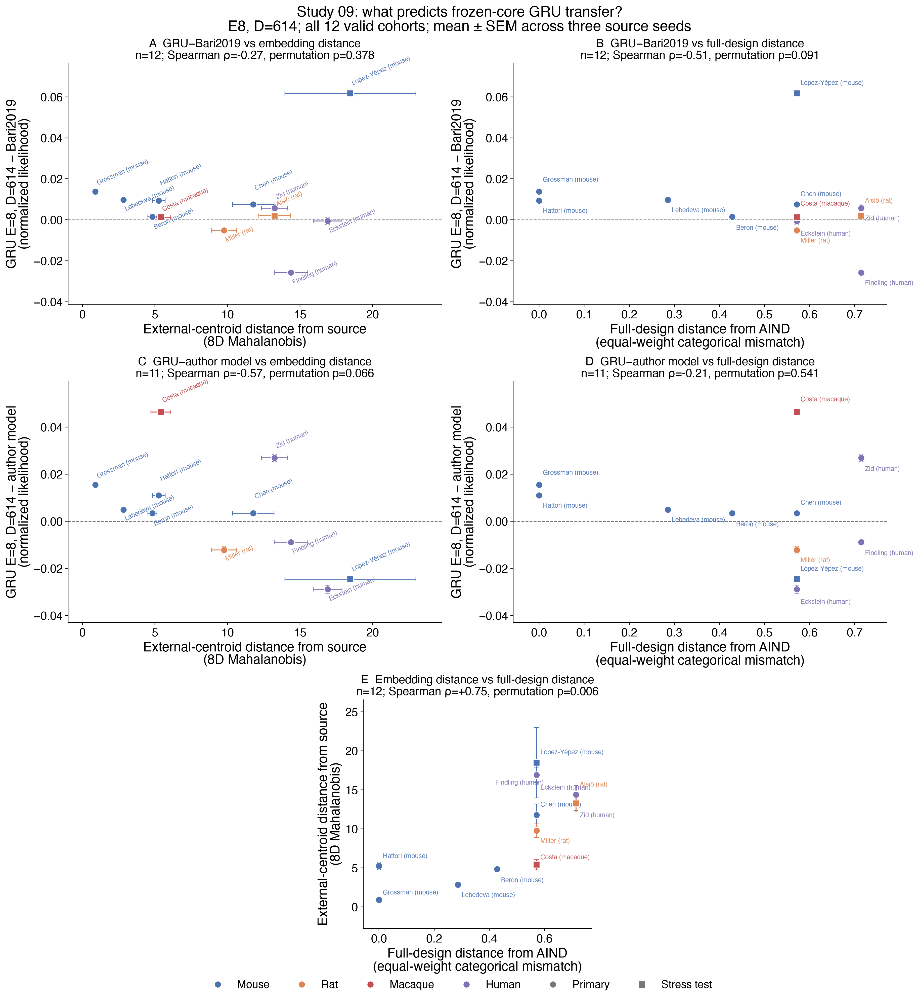

[SVG for slides](../fig_slide_r3_e8_generalization.svg)

The Bari2019 and embedding-versus-design panels include all 12 valid cohorts. The author-model panels include 11 because Alsiö (rat) has no cohort-aligned author reference. Every title reports the cohort-level Spearman ρ and two-sided permutation p for the exact quantities plotted.

### Detailed analysis figures

Result 3 contains 24 detailed figures: 16 main comparison panels (Bari2019 or author reference × bits/trial or normalized-likelihood scale × E=4 or E=8 × primary or all-valid inclusion), four robustness panels, and four task-design panels. All cohort markers are means across three source seeds with SEM error bars. A fixed baseline or task-design coordinate has zero horizontal SEM by design.

### Primary-inference cohorts

**E=4**


**E=8**

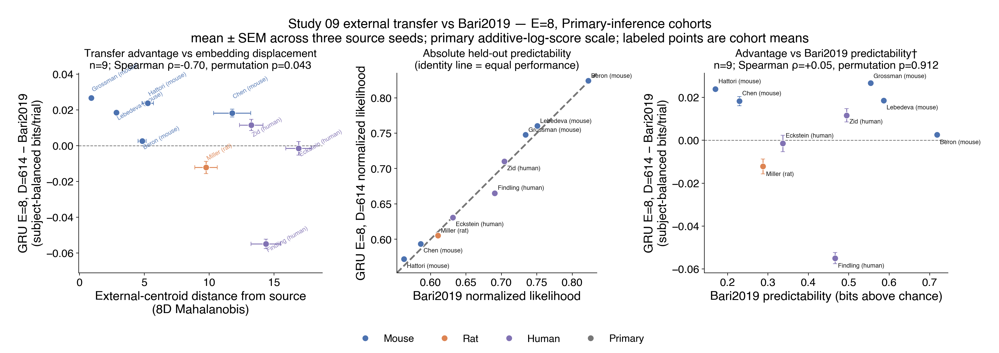

Primary inference uses 9 equal-weight cross-study cohorts. Performance is the arithmetic mean held-out log likelihood across subjects, converted to bits per trial. Embedding distance is calculated separately in the full E=4 or E=8 space for each source seed. Every marker is the mean across the three paired source seeds, with horizontal and vertical SEM bars. Inclusion tiers are shown in separate figures, so secondary cohorts no longer obscure the 9-cohort inference. All 12 valid cohorts remain included in the numerical sensitivity table. Species is descriptive rather than an inferential grouping because species, study, and task design are confounded.

### All valid cohorts (primary + stress-test)

**E=4**

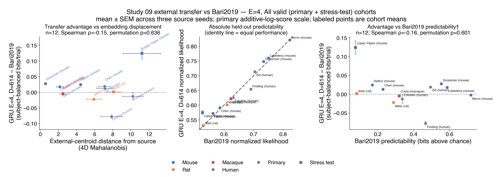

**E=8**

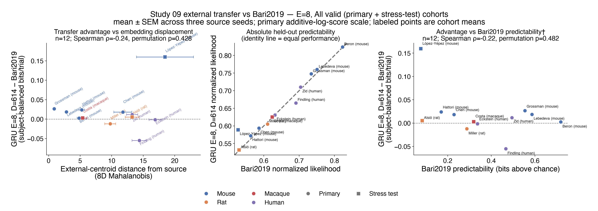

This cumulative sensitivity view adds Alsiö (rat), Costa (macaque), and López-Yépez (mouse), for 12 cohorts total. No descriptive-only cohort remains after Tang (macaque) was removed, so primary + stress-test and all valid are the same set and are shown only once.

### R1-scale companion: normalized-likelihood difference

These companion plots use the same normalized-likelihood units as Result 1. They retain Result 3's equal-subject aggregation: each source seed's GRU value is `exp(mean subject log likelihood)` minus the matched Bari2019 value. Each point is the three-seed mean, with horizontal and vertical SEM bars. The Bari2019 baseline is shared across source seeds, so its horizontal SEM is zero in the two Bari2019-axis panels. Panel titles report cross-cohort Spearman ρ and two-sided permutation p for the exact plotted normalized-likelihood quantities. The bits-per-trial plots above remain primary for additive cross-task inference.

#### Primary-inference cohorts

**E=4**

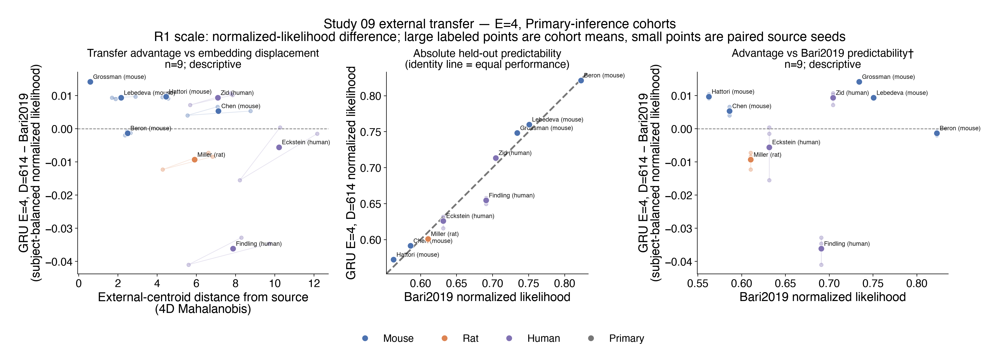

**E=8**

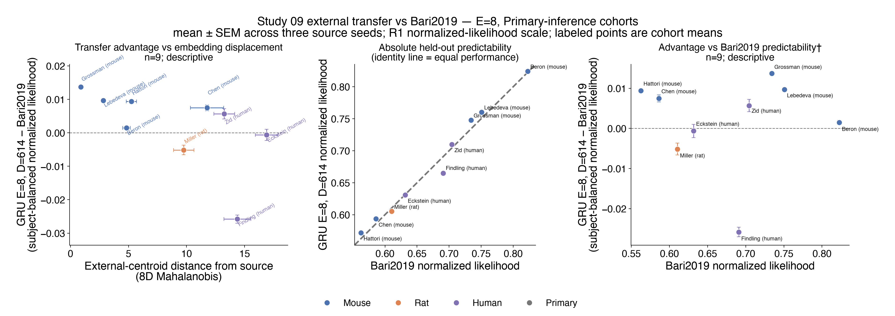

#### All valid cohorts (primary + stress-test)

**E=4**

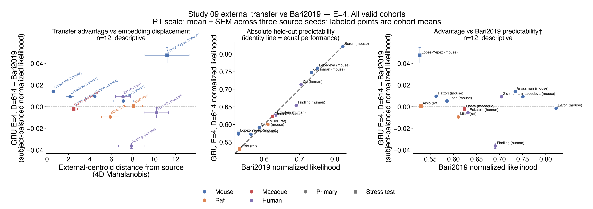

**E=8**

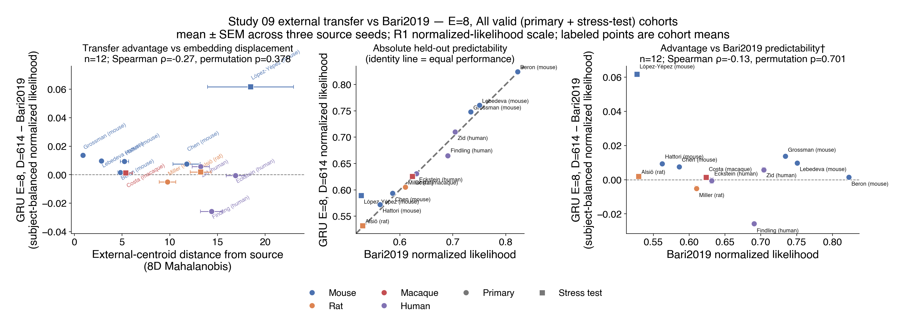

### Author-model companion

These panels repeat the same cross-cohort views with GRU minus the strongest model marked `author_selected` for each cohort. When a paper has multiple author-selected co-winners, the stronger trial-pooled held-out refit is used as a conservative comparator. Sensitivity-only models are excluded: Costa (macaque) therefore uses dual-rate RL plus fitted shape-choice bias, while the additional CK1 model remains a separately labeled mechanism sensitivity in Result 1. Alsiö (rat) has no cohort-aligned author model and is omitted from author-reference panels.

#### Primary-inference cohorts

**E=4, bits/trial**

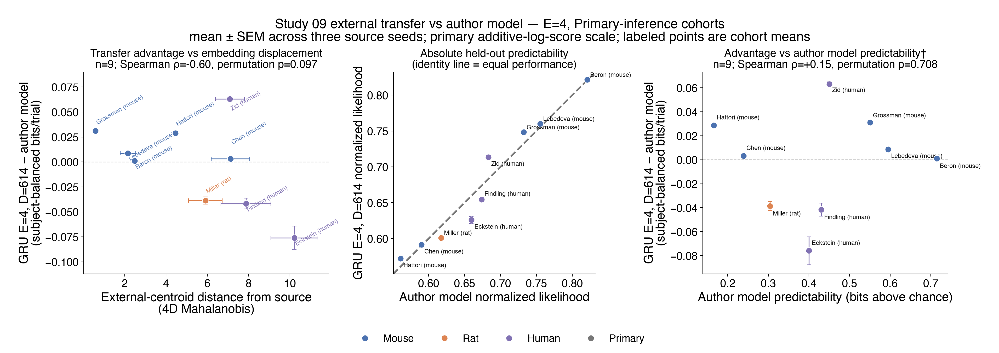

**E=8, bits/trial**

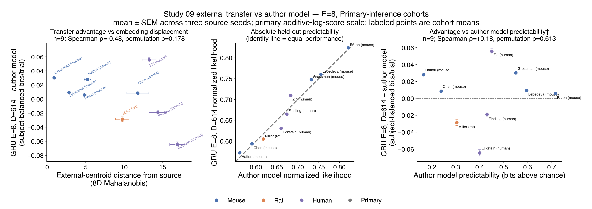

**E=4, normalized-likelihood difference**

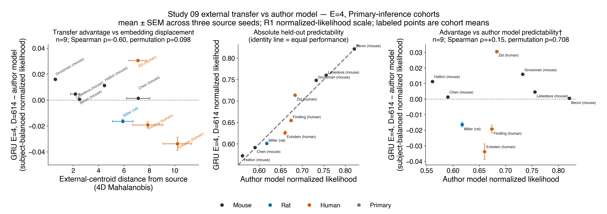

**E=8, normalized-likelihood difference**

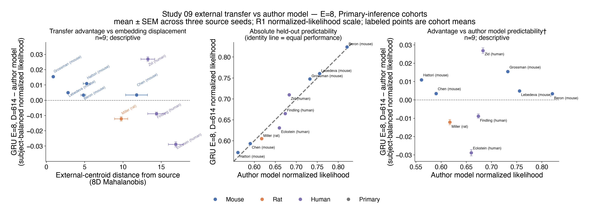

#### All valid cohorts (primary + stress-test)

**E=4, bits/trial**

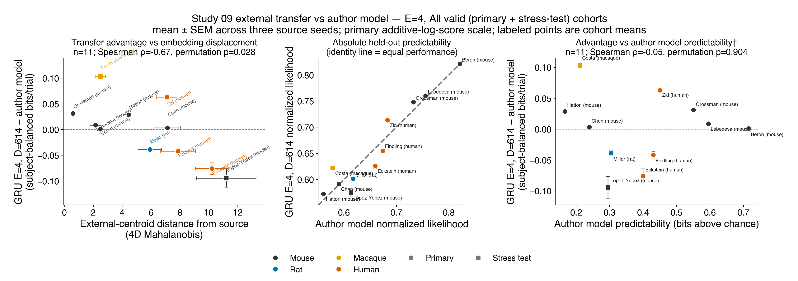

**E=8, bits/trial**

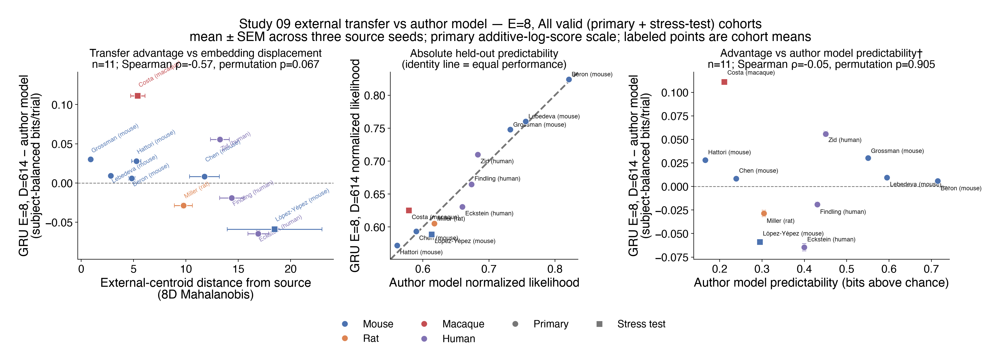

**E=4, normalized-likelihood difference**

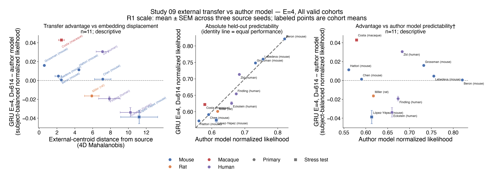

**E=8, normalized-likelihood difference**

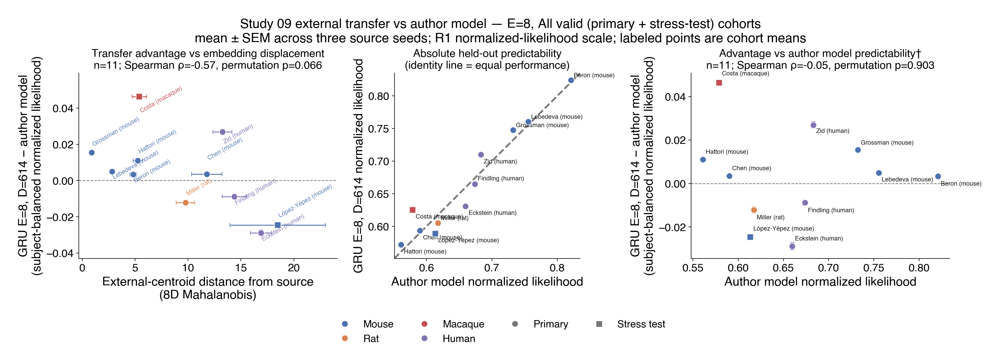

Across the primary cohorts with author references, GRU-minus-author advantage versus embedding-centroid distance has Spearman ρ=-0.600 for E=4 and ρ=-0.483 for E=8. The mathematically coupled GRU-minus-author versus author-predictability relationships are ρ=+0.150 and ρ=+0.183, respectively.

For E=4, the D=614 GRU has higher subject-balanced mean log likelihood than Bari2019 common Q in 5 cohorts (Grossman (mouse), Chen (mouse), Zid (human), Lebedeva (mouse), Hattori (mouse)) and lower mean log likelihood in 4 (Beron (mouse), Miller (rat), Findling (human), Eckstein (human)). This direction summary does not replace the paired subject tests in Result 1.

The additive log-score estimand is primary for cross-task comparison. Zid (human) is the only direction reversal under the mean subject normalized-likelihood difference: its log-score difference is positive, whereas its mean normalized-likelihood difference is negative, consistent with Result 1. Both values are retained below.

Across the 9 primary cohort means, GRU advantage and embedding-centroid distance have Spearman ρ=-0.633 (bootstrap 95% CI [-0.98, +0.05]; two-sided permutation p=0.0776). The leave-one-cohort-out range is [-0.74, -0.48].
For E=8, the corresponding association is ρ=-0.700 (bootstrap 95% CI [-0.98, -0.08]; two-sided permutation p=0.0432; leave-one-out [-0.79, -0.57]).

The identity plot is the primary view of baseline predictability. The right panel shows the requested GRU-minus-Bari2019 value against Bari2019, but its correlation is mathematically coupled because Q appears on both axes. It is therefore descriptive, The observed ρ is +0.083 for E=4 and +0.050 for E=8.

### Primary robustness and source-population scaling

**E=4**


**E=8**

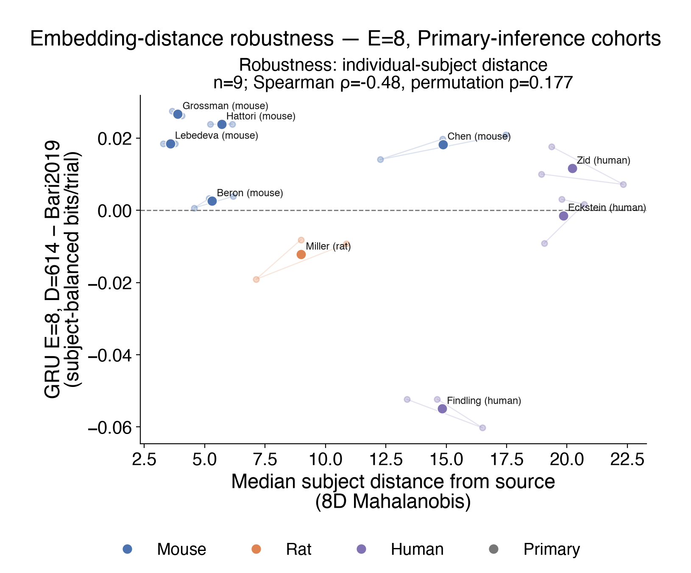

Median individual-subject embedding distance tests whether the centroid result is hiding a dispersed or bimodal cohort. The scaling panel asks whether increasing the source population from D=10 to D=614 helps cohorts that land farther from the source embedding distribution. Its cross-cohort Spearman ρ is +0.217 (permutation p=0.5511).

### All-valid robustness and scaling (primary + stress-test)

**E=4**

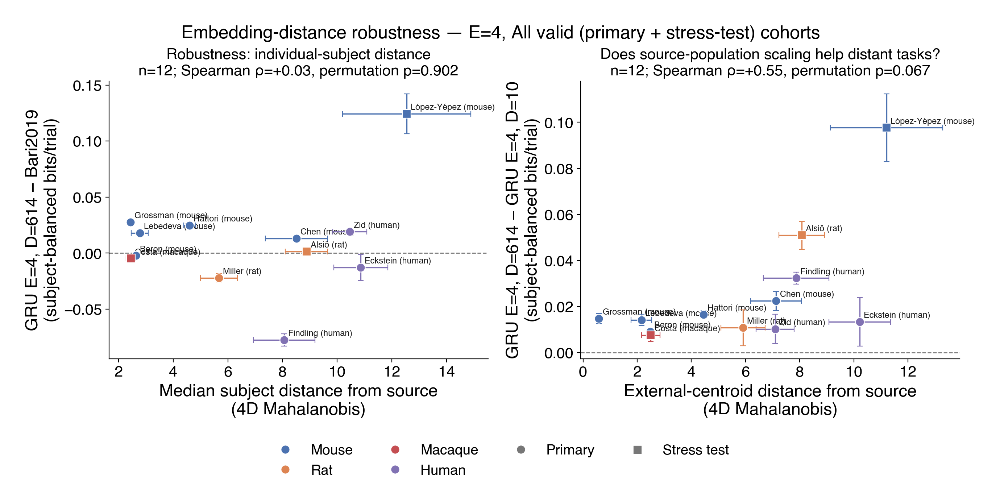

**E=8**

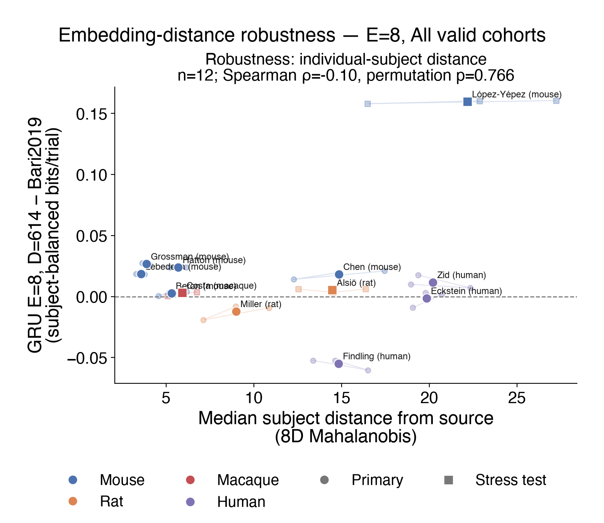

E8 was run only at D=614, so the source-population scaling panel is available only for E4; the E8 robustness figures therefore contain only the matched individual-subject-distance analysis.

### Valid cohort estimates

| space | cohort | tier | subjects | Bari2019 likelihood | GRU614 likelihood | GRU614−Bari2019 bits/trial | mean subject Δ likelihood | author reference | author likelihood | GRU614−author bits/trial | centroid distance | median subject distance | GRU614−GRU10 bits/trial |
|---|---|---|---:|---:|---:|---:|---:|---|---:|---:|---:|---:|---:|
| E=4 | Grossman (mouse) | primary | 48 | 0.7341 | 0.7483 | +0.0276 | +0.0139 | grossman-meta-learning | 0.7323 | +0.0311 | 0.58 | 2.44 | +0.0148 |
| E=4 | Chen (mouse) | primary | 32 | 0.5861 | 0.5914 | +0.0131 | +0.0053 | chen-rlck | 0.5901 | +0.0033 | 7.13 | 8.51 | +0.0225 |
| E=4 | Zid (human) | primary | 258 | 0.7043 | 0.7136 | +0.0190 | -0.0015 | zid-history-kernel-foraging | 0.6831 | +0.0632 | 7.09 | 10.46 | +0.0103 |
| E=4 | Lebedeva (mouse) | primary | 10 | 0.7507 | 0.7600 | +0.0179 | +0.0094 | lebedeva-pr | 0.7554 | +0.0088 | 2.15 | 2.78 | +0.0142 |
| E=4 | Beron (mouse) | primary | 6 | 0.8227 | 0.8214 | -0.0023 | -0.0013 | beron-rflr | 0.8208 | +0.0010 | 2.49 | 2.64 | +0.0092 |
| E=4 | Miller (rat) | primary | 20 | 0.6104 | 0.6011 | -0.0222 | -0.0093 | miller-rhg | 0.6174 | -0.0386 | 5.91 | 5.67 | +0.0108 |
| E=4 | Findling (human) | primary | 22 | 0.6907 | 0.6546 | -0.0776 | -0.0372 | findling-weber-imprecision | 0.6737 | -0.0417 | 7.87 | 8.06 | +0.0323 |
| E=4 | Alsiö (rat) | stress test | 95 | 0.5297 | 0.5303 | +0.0015 | +0.0007 | — | — | — | 8.08 | 8.88 | +0.0510 |
| E=4 | Eckstein (human) | primary | 306 | 0.6315 | 0.6259 | -0.0128 | -0.0180 | eckstein-bi | 0.6597 | -0.0759 | 10.21 | 10.87 | +0.0134 |
| E=4 | Costa (macaque) | stress test | 11 | 0.6239 | 0.6218 | -0.0049 | -0.0027 | costa-feedback-dependent | 0.5789 | +0.1033 | 2.50 | 2.45 | +0.0076 |
| E=4 | López-Yépez (mouse) | stress test | 8 | 0.5272 | 0.5747 | +0.1243 | +0.0472 | lopez-double-trace | 0.6135 | -0.0944 | 11.21 | 12.54 | +0.0976 |
| E=4 | Hattori (mouse) | primary | 7 | 0.5625 | 0.5722 | +0.0247 | +0.0097 | hattori-q-learning | 0.5609 | +0.0288 | 4.45 | 4.60 | +0.0165 |
| E=8 | Grossman (mouse) | primary | 48 | 0.7341 | 0.7478 | +0.0267 | +0.0134 | grossman-meta-learning | 0.7323 | +0.0302 | 0.89 | 3.89 | — |
| E=8 | Chen (mouse) | primary | 32 | 0.5861 | 0.5935 | +0.0183 | +0.0074 | chen-rlck | 0.5901 | +0.0084 | 11.77 | 14.86 | — |
| E=8 | Zid (human) | primary | 258 | 0.7043 | 0.7100 | +0.0116 | -0.0046 | zid-history-kernel-foraging | 0.6831 | +0.0557 | 13.25 | 20.21 | — |
| E=8 | Lebedeva (mouse) | primary | 10 | 0.7507 | 0.7603 | +0.0185 | +0.0097 | lebedeva-pr | 0.7554 | +0.0094 | 2.83 | 3.58 | — |
| E=8 | Beron (mouse) | primary | 6 | 0.8227 | 0.8242 | +0.0026 | +0.0015 | beron-rflr | 0.8208 | +0.0059 | 4.82 | 5.31 | — |
| E=8 | Miller (rat) | primary | 20 | 0.6104 | 0.6052 | -0.0122 | -0.0052 | miller-rhg | 0.6174 | -0.0287 | 9.76 | 8.99 | — |
| E=8 | Findling (human) | primary | 22 | 0.6907 | 0.6649 | -0.0549 | -0.0265 | findling-weber-imprecision | 0.6737 | -0.0190 | 14.38 | 14.83 | — |
| E=8 | Alsiö (rat) | stress test | 95 | 0.5297 | 0.5316 | +0.0052 | +0.0020 | — | — | — | 13.25 | 14.48 | — |
| E=8 | Eckstein (human) | primary | 306 | 0.6315 | 0.6308 | -0.0015 | -0.0138 | eckstein-bi | 0.6597 | -0.0646 | 16.90 | 19.85 | — |
| E=8 | Costa (macaque) | stress test | 11 | 0.6239 | 0.6252 | +0.0029 | +0.0010 | costa-feedback-dependent | 0.5789 | +0.1111 | 5.40 | 5.93 | — |
| E=8 | López-Yépez (mouse) | stress test | 8 | 0.5272 | 0.5889 | +0.1597 | +0.0616 | lopez-double-trace | 0.6135 | -0.0591 | 18.47 | 22.19 | — |
| E=8 | Hattori (mouse) | primary | 7 | 0.5625 | 0.5719 | +0.0239 | +0.0094 | hattori-q-learning | 0.5609 | +0.0280 | 5.25 | 5.70 | — |

Normalized likelihoods in this table are `exp(mean subject log likelihood)`, not trial-pooled values. This prevents large cohorts or long sessions from dominating a cross-study comparison.

### Primary cross-cohort inference — E=4

| relationship | n | Spearman ρ | cohort-bootstrap 95% CI | permutation p | leave-one-cohort-out ρ |
|---|---:|---:|---:|---:|---:|
| GRU614−Q vs embedding centroid distance | 9 | -0.633 | [-0.98, +0.05] | 0.0776 | [-0.74, -0.48] |
| GRU614−Q vs median subject embedding distance | 9 | -0.400 | [-0.89, +0.42] | 0.2903 | [-0.60, -0.14] |
| GRU614−Bari2019 vs Bari2019 predictability† | 9 | +0.083 | [-0.72, +0.70] | 0.8088 | [-0.12, +0.40] |
| GRU614−author vs embedding centroid distance | 9 | -0.600 | [-1.00, +0.19] | 0.0974 | [-0.83, -0.43] |
| GRU614−author vs author predictability† | 9 | +0.150 | [-0.63, +0.67] | 0.7081 | [+0.00, +0.38] |
| Normalized-likelihood GRU614−Bari2019 vs embedding centroid distance | 9 | -0.633 | [-0.98, +0.05] | 0.0776 | [-0.74, -0.48] |
| Normalized-likelihood GRU614−Bari2019 vs Bari2019 likelihood† | 9 | +0.083 | [-0.72, +0.70] | 0.8111 | [-0.12, +0.40] |
| Normalized-likelihood GRU614−author vs embedding centroid distance | 9 | -0.600 | [-1.00, +0.20] | 0.0984 | [-0.83, -0.43] |
| Normalized-likelihood GRU614−author vs author likelihood† | 9 | +0.150 | [-0.65, +0.67] | 0.7081 | [+0.00, +0.38] |
| GRU614−GRU10 vs embedding centroid distance | 9 | +0.217 | [-0.59, +0.88] | 0.5511 | [+0.00, +0.43] |

### Primary cross-cohort inference — E=8

| relationship | n | Spearman ρ | cohort-bootstrap 95% CI | permutation p | leave-one-cohort-out ρ |
|---|---:|---:|---:|---:|---:|
| GRU614−Q vs embedding centroid distance | 9 | -0.700 | [-0.98, -0.08] | 0.0432 | [-0.79, -0.57] |
| GRU614−Q vs median subject embedding distance | 9 | -0.483 | [-0.86, +0.24] | 0.1774 | [-0.60, -0.31] |
| GRU614−Bari2019 vs Bari2019 predictability† | 9 | +0.050 | [-0.74, +0.72] | 0.9124 | [-0.19, +0.36] |
| GRU614−author vs embedding centroid distance | 9 | -0.483 | [-0.98, +0.37] | 0.1776 | [-0.79, -0.26] |
| GRU614−author vs author predictability† | 9 | +0.183 | [-0.59, +0.75] | 0.6132 | [+0.05, +0.43] |
| Normalized-likelihood GRU614−Bari2019 vs embedding centroid distance | 9 | -0.733 | [-1.00, -0.11] | 0.0257 | [-0.83, -0.62] |
| Normalized-likelihood GRU614−Bari2019 vs Bari2019 likelihood† | 9 | +0.167 | [-0.73, +0.73] | 0.6480 | [-0.05, +0.36] |
| Normalized-likelihood GRU614−author vs embedding centroid distance | 9 | -0.483 | [-0.98, +0.36] | 0.1791 | [-0.79, -0.26] |
| Normalized-likelihood GRU614−author vs author likelihood† | 9 | +0.183 | [-0.61, +0.75] | 0.6138 | [+0.05, +0.43] |

### All-valid sensitivity — E=4

This sensitivity adds Alsiö (rat), Costa (macaque), and López-Yépez (mouse). It still excludes quarantined Kwak (mouse).

| relationship | n | Spearman ρ | cohort-bootstrap 95% CI | permutation p | leave-one-cohort-out ρ |
|---|---:|---:|---:|---:|---:|
| GRU614−Q vs embedding centroid distance | 12 | -0.154 | [-0.80, +0.50] | 0.6357 | [-0.50, +0.00] |
| GRU614−Q vs median subject embedding distance | 12 | +0.035 | [-0.66, +0.69] | 0.9024 | [-0.25, +0.25] |
| GRU614−Bari2019 vs Bari2019 predictability† | 12 | -0.161 | [-0.74, +0.51] | 0.6011 | [-0.33, +0.09] |
| GRU614−author vs embedding centroid distance | 11 | -0.673 | [-0.97, -0.06] | 0.0280 | [-0.81, -0.56] |
| GRU614−author vs author predictability† | 11 | -0.045 | [-0.66, +0.62] | 0.9036 | [-0.18, +0.24] |
| Normalized-likelihood GRU614−Bari2019 vs embedding centroid distance | 12 | -0.154 | [-0.80, +0.51] | 0.6358 | [-0.50, +0.00] |
| Normalized-likelihood GRU614−Bari2019 vs Bari2019 likelihood† | 12 | -0.161 | [-0.74, +0.51] | 0.6051 | [-0.33, +0.09] |
| Normalized-likelihood GRU614−author vs embedding centroid distance | 11 | -0.673 | [-0.97, -0.07] | 0.0281 | [-0.81, -0.56] |
| Normalized-likelihood GRU614−author vs author likelihood† | 11 | -0.045 | [-0.65, +0.63] | 0.9027 | [-0.18, +0.24] |
| GRU614−GRU10 vs embedding centroid distance | 12 | +0.545 | [-0.09, +0.94] | 0.0666 | [+0.41, +0.69] |

### All-valid sensitivity — E=8

| relationship | n | Spearman ρ | cohort-bootstrap 95% CI | permutation p | leave-one-cohort-out ρ |
|---|---:|---:|---:|---:|---:|
| GRU614−Q vs embedding centroid distance | 12 | -0.245 | [-0.87, +0.48] | 0.4278 | [-0.62, -0.12] |
| GRU614−Q vs median subject embedding distance | 12 | -0.098 | [-0.72, +0.59] | 0.7657 | [-0.43, +0.05] |
| GRU614−Bari2019 vs Bari2019 predictability† | 12 | -0.224 | [-0.80, +0.47] | 0.4824 | [-0.41, +0.01] |
| GRU614−author vs embedding centroid distance | 11 | -0.573 | [-0.91, +0.09] | 0.0669 | [-0.75, -0.44] |
| GRU614−author vs author predictability† | 11 | -0.045 | [-0.66, +0.63] | 0.9050 | [-0.18, +0.24] |
| Normalized-likelihood GRU614−Bari2019 vs embedding centroid distance | 12 | -0.273 | [-0.90, +0.45] | 0.3779 | [-0.65, -0.15] |
| Normalized-likelihood GRU614−Bari2019 vs Bari2019 likelihood† | 12 | -0.126 | [-0.75, +0.56] | 0.7009 | [-0.30, +0.14] |
| Normalized-likelihood GRU614−author vs embedding centroid distance | 11 | -0.573 | [-0.91, +0.09] | 0.0657 | [-0.75, -0.44] |
| Normalized-likelihood GRU614−author vs author likelihood† | 11 | -0.045 | [-0.65, +0.63] | 0.9029 | [-0.18, +0.24] |

† In baseline-predictability panels, the same Bari2019 or author-model value appears on the horizontal axis and inside the GRU-minus-baseline vertical axis. These correlations are mathematically coupled and are not independent tests of whether intrinsically easier tasks transfer better.

## Task-design meta-analysis

### Primary task-design view

**E=4**


**E=8**

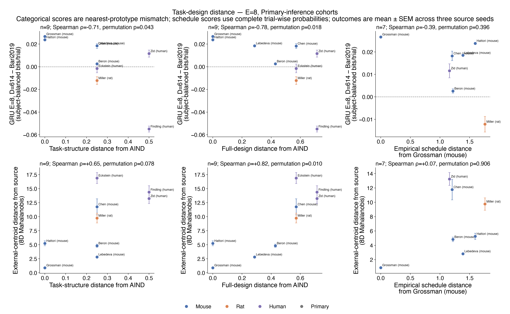

The categorical analysis is outcome-blind. Task-structure distance is the equal-weight mismatch over schedule family, arm coupling, baiting, and what the subject chooses. Full-design distance adds physical context, response modality, and reward modality. Each cohort is scored against the nearest of the three task prototypes actually represented in the AIND source-training snapshot; this preserves source heterogeneity and makes Grossman (mouse) a zero-distance anchor.

Task-structure distance is associated with adapted embedding-centroid displacement (ρ=+0.581, permutation p=0.1314) but not with GRU advantage (ρ=-0.581, p=0.1336). The same separation is stronger for the full-design score: embedding ρ=+0.778 (p=0.0185), versus GRU advantage ρ=-0.641 (p=0.0721). Thus the transferred embedding geometry carries an auditable task/apparatus-distance signal, but categorical closeness alone does not explain whether GRU beats Bari2019 common Q.
For E=8, task-structure distance has ρ=+0.645 with embedding displacement and ρ=-0.710 with GRU advantage. Full-design distance has ρ=+0.821 with embedding displacement and ρ=-0.778 with GRU advantage.

### All-valid task-design view (primary + stress-test)

**E=4**

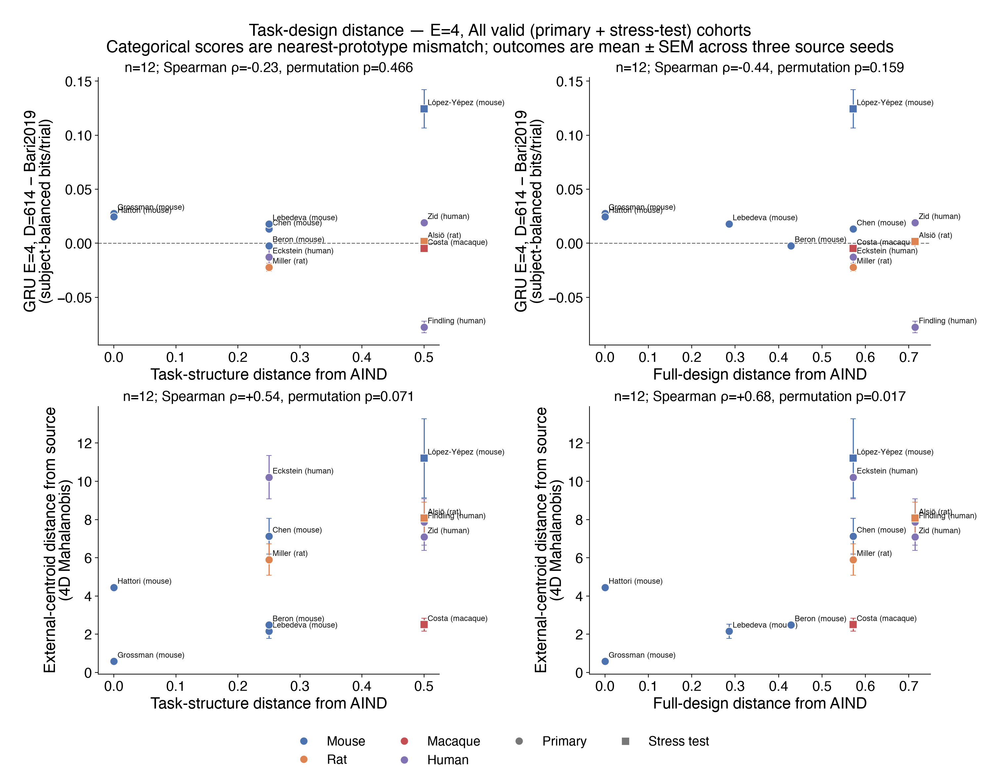

**E=8**

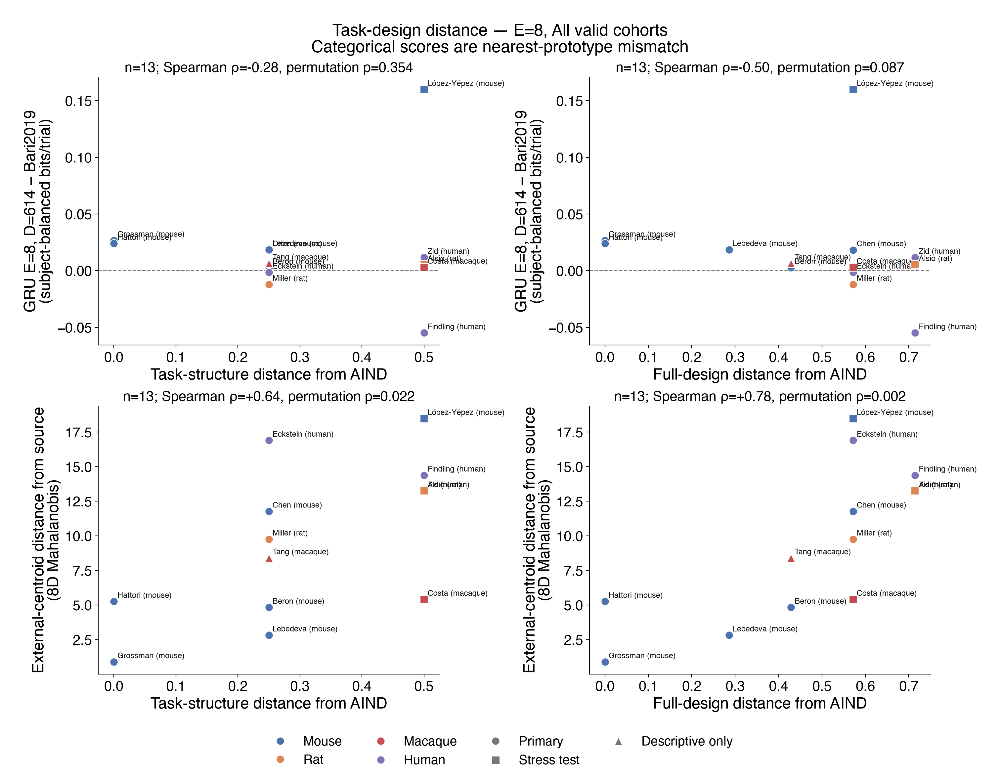

### Species-stratified all-valid description

| space | species | cohorts | mean GRU614−Q bits/trial | median | range | mean embedding distance | mean task distance |
|---|---|---:|---:|---:|---:|---:|---:|
| E=4 | Mouse | 6 | +0.0342 | +0.0213 | [-0.0023, +0.1243] | 4.67 | 0.12 |
| E=4 | Rat | 2 | -0.0103 | -0.0103 | [-0.0222, +0.0015] | 6.99 | 0.38 |
| E=4 | Macaque | 1 | -0.0049 | -0.0049 | [-0.0049, -0.0049] | 2.50 | 0.50 |
| E=4 | Human | 3 | -0.0238 | -0.0128 | [-0.0776, +0.0190] | 8.39 | 0.42 |
| E=8 | Mouse | 6 | +0.0416 | +0.0212 | [+0.0026, +0.1597] | 7.34 | 0.12 |
| E=8 | Rat | 2 | -0.0035 | -0.0035 | [-0.0122, +0.0052] | 11.50 | 0.38 |
| E=8 | Macaque | 1 | +0.0029 | +0.0029 | [+0.0029, +0.0029] | 5.40 | 0.50 |
| E=8 | Human | 3 | -0.0149 | -0.0015 | [-0.0549, +0.0116] | 14.84 | 0.42 |

These are equal-cohort descriptive summaries, not species effects. Each species is represented by only two to six studies, and task design differs systematically by species. In particular, a species contrast would currently relabel the same design and apparatus contrasts rather than isolate biology.

For the 7 primary cohorts whose canonical adapters expose complete trial-wise probabilities for both arms, empirical schedule distance from Grossman (mouse) is negatively associated with GRU advantage (ρ=-0.536, exact permutation p=0.2357; bootstrap 95% CI [-1.00, +0.62]; leave-one-out range [-0.83, -0.26]). Its association with embedding-centroid distance is weak (ρ=+0.107, p=0.8397). The performance result is promising but small-sample: the bootstrap interval crosses zero, and Grossman (mouse) defines the schedule-distance origin.
For E=8, schedule distance versus GRU advantage is ρ=-0.393 (p=0.3956), while schedule distance versus embedding-centroid distance is ρ=+0.071 (p=0.9063).

### Evidence-backed categorical matrix

| cohort | tier | schedule | coupling | baited | choice target | context | response | reward | task distance | full distance |
|---|---|---|---|---|---|---|---|---|---:|---:|
| [Grossman (mouse)](https://pmc.ncbi.nlm.nih.gov/articles/PMC8825708/) | primary | blockwise | independent | no | spatial action | head fixed | lick | water | 0.00 | 0.00 |
| [Chen (mouse)](https://pmc.ncbi.nlm.nih.gov/articles/PMC8794469/) | primary | random walk | independent | no | spatial action | freely moving | nose poke | liquid food | 0.25 | 0.57 |
| [Zid (human)](https://www.nature.com/articles/s41467-026-75773-4) | primary | random walk | independent | no | abstract option | online | computer input | monetary points | 0.50 | 0.71 |
| [Lebedeva (mouse)](https://www.nature.com/articles/s41467-026-71664-w) | primary | blockwise | coupled | no | spatial action | head fixed | wheel | water | 0.25 | 0.29 |
| [Beron (mouse)](https://pmc.ncbi.nlm.nih.gov/articles/PMC9169659/) | primary | blockwise | coupled | no | spatial action | freely moving | nose poke | water | 0.25 | 0.43 |
| [Miller (rat)](https://www.biorxiv.org/content/10.1101/461129v3) | primary | random walk | independent | no | spatial action | freely moving | nose poke | liquid food | 0.25 | 0.57 |
| [Findling (human)](https://pmc.ncbi.nlm.nih.gov/articles/PMC12728203/) | primary | blockwise | coupled | no | visual stimulus | laboratory | handheld button | monetary points | 0.50 | 0.71 |
| [Alsiö (rat)](https://pmc.ncbi.nlm.nih.gov/articles/PMC6695374/) | stress test | criterion reversal | coupled | no | spatial action, visual stimulus | freely moving | touchscreen | food pellet | 0.50 | 0.71 |
| [Eckstein (human)](https://pmc.ncbi.nlm.nih.gov/articles/PMC9108470/) | primary | blockwise | coupled | no | spatial action | laboratory | keyboard | monetary points | 0.25 | 0.57 |
| [Costa (macaque)](https://pmc.ncbi.nlm.nih.gov/articles/PMC5074688/) | stress test | blockwise | coupled | no | visual stimulus | head fixed | saccade | juice | 0.50 | 0.57 |
| [López-Yépez (mouse)](https://doi.org/10.1371/journal.pcbi.1009452) | stress test | blockwise | independent | yes | spatial action | freely moving | nose poke | water | 0.00 | 0.29 |
| [Hattori (mouse)](https://www.nature.com/articles/s41593-023-01485-3) | primary | blockwise | coupled | yes | spatial action | head fixed | lick | water | 0.00 | 0.00 |

Cohort names link to the primary Methods source used for annotation. The complete evidence note for every row, the three AIND prototypes, and the scoring contract are frozen in `analysis/task_design_features.json`.

### Empirical reward-schedule features

| cohort | arm lag-1 | gap lag-1 | cross-arm | change rate | step size | mean abs(gap) | mean p(reward) | equal-p fraction | distance to Grossman (mouse) |
|---|---:|---:|---:|---:|---:|---:|---:|---:|---:|
| Grossman (mouse) | 0.950 | 0.953 | -0.375 | 0.053 | 0.555 | 0.471 | 0.508 | 0.170 | 0.00 |
| Chen (mouse) | 0.978 | 0.984 | -0.460 | 0.153 | 0.102 | 0.285 | 0.560 | 0.111 | 1.20 |
| Zid (human) | 0.973 | 0.975 | -0.022 | 0.170 | 0.100 | 0.306 | 0.508 | 0.100 | 1.16 |
| Lebedeva (mouse) | 0.987 | 0.987 | -1.000 | 0.006 | 0.600 | 0.600 | 0.500 | 0.000 | 1.39 |
| Beron (mouse) | 0.960 | 0.960 | -1.000 | 0.020 | 0.580 | 0.580 | 0.500 | 0.000 | 1.22 |
| Miller (rat) | 0.917 | 0.917 | 0.003 | 0.992 | 0.111 | 0.381 | 0.496 | 0.017 | 1.76 |
| Hattori (mouse) | 0.975 | 0.975 | -0.995 | 0.014 | 0.428 | 0.438 | 0.349 | 0.000 | 1.59 |

Every metric is computed using only within-session transitions. Subjects are summarized first and then averaged equally within a cohort. The composite distance is the root-mean-square standardized Euclidean distance across seven predeclared features; reward-gap autocorrelation is reported but omitted from the distance because it largely duplicates the two arm-autocorrelation terms. No missing schedule is imputed.

#### E=4

| relationship | n | Spearman ρ | cohort-bootstrap 95% CI | permutation p | leave-one-cohort-out ρ |
|---|---:|---:|---:|---:|---:|
| GRU614−Q vs task-structure distance | 9 | -0.581 | [-0.96, +0.44] | 0.1336 (monte_carlo) | [-0.87, -0.38] |
| embedding vs task-structure distance | 9 | +0.581 | [+0.00, +0.92] | 0.1314 (monte_carlo) | [+0.41, +0.69] |
| GRU614−Q vs full-design distance | 9 | -0.641 | [-1.00, +0.16] | 0.0721 (monte_carlo) | [-0.92, -0.49] |
| embedding vs full-design distance | 9 | +0.778 | [+0.25, +0.99] | 0.0185 (monte_carlo) | [+0.71, +0.84] |
| GRU614−Q vs empirical schedule distance | 7 | -0.536 | [-1.00, +0.62] | 0.2357 (exact) | [-0.83, -0.26] |
| embedding vs empirical schedule distance | 7 | +0.107 | [-0.75, +1.00] | 0.8397 (exact) | [-0.43, +0.37] |

#### E=8

| relationship | n | Spearman ρ | cohort-bootstrap 95% CI | permutation p | leave-one-cohort-out ρ |
|---|---:|---:|---:|---:|---:|
| GRU614−Q vs task-structure distance | 9 | -0.710 | [-0.96, +0.00] | 0.0433 (monte_carlo) | [-0.87, -0.58] |
| embedding vs task-structure distance | 9 | +0.645 | [+0.09, +0.96] | 0.0781 (monte_carlo) | [+0.51, +0.77] |
| GRU614−Q vs full-design distance | 9 | -0.778 | [-1.00, -0.18] | 0.0180 (monte_carlo) | [-0.92, -0.68] |
| embedding vs full-design distance | 9 | +0.821 | [+0.38, +1.00] | 0.0104 (monte_carlo) | [+0.77, +0.88] |
| GRU614−Q vs empirical schedule distance | 7 | -0.393 | [-1.00, +0.96] | 0.3956 (exact) | [-0.60, -0.03] |
| embedding vs empirical schedule distance | 7 | +0.071 | [-0.96, +1.00] | 0.9063 (exact) | [-0.49, +0.37] |

### All-valid categorical sensitivity — E=4

| relationship | n | Spearman ρ | cohort-bootstrap 95% CI | permutation p | leave-one-cohort-out ρ |
|---|---:|---:|---:|---:|---:|
| GRU614−Q vs task-structure distance | 12 | -0.603 | [-0.91, +0.04] | 0.0419 (monte_carlo) | [-0.74, -0.49] |
| embedding vs task-structure distance | 12 | +0.179 | [-0.49, +0.79] | 0.5750 (monte_carlo) | [-0.01, +0.47] |
| GRU614−Q vs full-design distance | 12 | -0.608 | [-0.93, +0.00] | 0.0401 (monte_carlo) | [-0.77, -0.51] |
| embedding vs full-design distance | 12 | +0.500 | [-0.17, +0.92] | 0.1000 (monte_carlo) | [+0.36, +0.75] |

### All-valid categorical sensitivity — E=8

| relationship | n | Spearman ρ | cohort-bootstrap 95% CI | permutation p | leave-one-cohort-out ρ |
|---|---:|---:|---:|---:|---:|
| GRU614−Q vs task-structure distance | 12 | -0.637 | [-0.93, +0.00] | 0.0300 (monte_carlo) | [-0.71, -0.53] |
| embedding vs task-structure distance | 12 | +0.276 | [-0.42, +0.84] | 0.3803 (monte_carlo) | [+0.11, +0.59] |
| GRU614−Q vs full-design distance | 12 | -0.669 | [-0.92, -0.08] | 0.0208 (monte_carlo) | [-0.75, -0.58] |
| embedding vs full-design distance | 12 | +0.569 | [-0.11, +0.95] | 0.0564 (monte_carlo) | [+0.45, +0.83] |

### Individual schedule-feature screen

| space | schedule feature vs GRU614−Q | Spearman ρ | exact p | BH-FDR q |
|---|---|---:|---:|---:|
| E=4 | mean arm lag-1 autocorrelation | +0.179 | 0.7131 | 0.9635 |
| E=4 | reward-gap lag-1 autocorrelation | +0.143 | 0.7825 | 0.9635 |
| E=4 | contemporaneous cross-arm correlation | -0.071 | 0.9063 | 0.9635 |
| E=4 | probability-change rate | -0.357 | 0.4444 | 0.9635 |
| E=4 | mean absolute arm step when changed | +0.036 | 0.9635 | 0.9635 |
| E=4 | mean absolute reward gap | +0.107 | 0.8397 | 0.9635 |
| E=4 | mean reward probability | +0.108 | 0.8206 | 0.9635 |
| E=4 | equal-probability fraction | +0.296 | 0.5238 | 0.9635 |
| E=8 | mean arm lag-1 autocorrelation | +0.357 | 0.4444 | 0.7347 |
| E=8 | reward-gap lag-1 autocorrelation | +0.250 | 0.5948 | 0.7347 |
| E=8 | contemporaneous cross-arm correlation | -0.321 | 0.4976 | 0.7347 |
| E=8 | probability-change rate | -0.571 | 0.2000 | 0.7347 |
| E=8 | mean absolute arm step when changed | +0.286 | 0.5560 | 0.7347 |
| E=8 | mean absolute reward gap | +0.250 | 0.5948 | 0.7347 |
| E=8 | mean reward probability | +0.054 | 0.9190 | 0.9190 |
| E=8 | equal-probability fraction | +0.222 | 0.6429 | 0.7347 |

No individual schedule feature survives the eight-feature FDR correction. The composite distance result should therefore motivate preregistered tests on additional datasets, not a post-hoc claim that one schedule statistic is the mechanism.

## What this version can and cannot answer

Embedding distance is measured after embedding-only adaptation, so it can reflect both task structure and cohort behavior. Species, study, apparatus, reward schedule, and data volume remain confounded, and even the 12-cohort sensitivity set is too small for a causal species effect or a stable multivariable regression. Species colors are descriptive only.

### Quarantined result

Kwak (mouse) is excluded from every plot, correlation, ranking, direction count, and species summary. The frozen split adapts on CNO sessions and tests on DMSO sessions, so it mixes treatment transfer with subject adaptation. The required replacement keeps only DMSO/control sessions, adapts on chronological odd DMSO sessions, and tests on chronological even DMSO sessions. No rerun was launched in this cleanup.

The next defensible extension is to recover explicit schedules for the remaining excluded adapters, then test whether the schedule-distance relationship replicates. An LLM pairwise closeness rank remains a blinded sensitivity analysis: prompts and Methods excerpts should be frozen before exposing the model to GRU outcomes, and agreement with the auditable matrix should be reported rather than used to replace it.

## Reproduce

The report and figures are offline products of the committed frozen summary:

```bash
make -C studies/09-gru-cross-species-transfer r3
```
<!-- END result-3 -->
