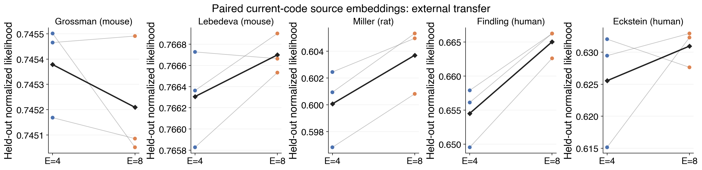
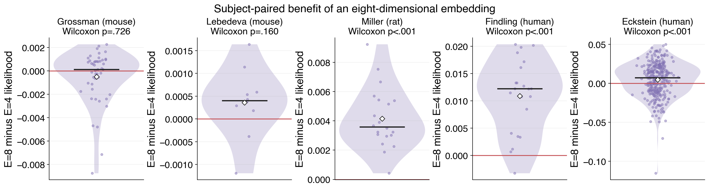

# Result 4 — does a wider subject embedding improve external transfer?

This report compares paired current-code E=4 and E=8 source GRUs at D=614 and
H=128. Both dimensions use the same three source seeds, AIND source snapshot,
training recipe, external adaptation observations, 500-step adaptation at
learning rate 0.001, and immutable held-out trials.

The diagnostic cohorts are Grossman (mouse), Lebedeva (mouse), Miller (rat),
Findling (human), and Eckstein (human). The source core stays frozen; only each
external subject embedding is adapted.

<!-- BEGIN result-4 -->

Each thin line joins the same source seed. The black diamond-line is the three-seed mean.

Dots are subjects; the short bar is the median and the hollow diamond is the mean. P-values are two-sided paired Wilcoxon signed-rank tests against zero.

| cohort | subjects | held-out trials | E=4 mean ± SD | E=8 mean ± SD | subject median Δ | subject mean Δ | Wilcoxon p |
|---|---:|---:|---:|---:|---:|---:|---:|
| Grossman (mouse) | 48 | 101,877 | 0.74538 ± 0.00018 | 0.74521 ± 0.00024 | +0.00013 | -0.00050 | 0.726 |
| Lebedeva (mouse) | 10 | 63,993 | 0.76631 ± 0.00045 | 0.76670 ± 0.00019 | +0.00040 | +0.00036 | 0.16 |
| Miller (rat) | 20 | 515,238 | 0.60007 ± 0.00291 | 0.60371 ± 0.00251 | +0.00358 | +0.00415 | 1.91e-06 |
| Findling (human) | 22 | 11,706 | 0.65453 ± 0.00441 | 0.66505 ± 0.00210 | +0.01222 | +0.01089 | 2.38e-06 |
| Eckstein (human) | 306 | 20,248 | 0.62554 ± 0.00908 | 0.63093 ± 0.00288 | +0.00720 | +0.00461 | 1.32e-05 |

E8 is neutral on the two closer mouse tasks: pooled Δ=-0.00017 for Grossman (mouse) and +0.00039 for Lebedeva (mouse), with neither subject-level test significant. In contrast, E8 improves all three harder cross-task/species cohorts: pooled Δ=+0.00364 for Miller (rat), +0.01052 for Findling (human), and +0.00540 for Eckstein (human), each with subject-level Wilcoxon p<.001.

**Decision:** expand E8 to every non-quarantined valid Study 09 cohort. The diagnostic screen shows reproducible benefit in the three difficult cohorts and no significant subject-level loss in either close mouse cohort; the broader panel can test whether that benefit tracks task distance or baseline predictability.
<!-- END result-4 -->
