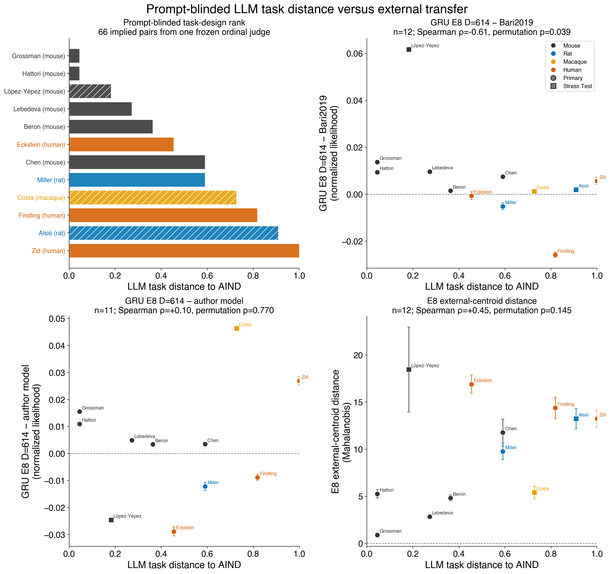
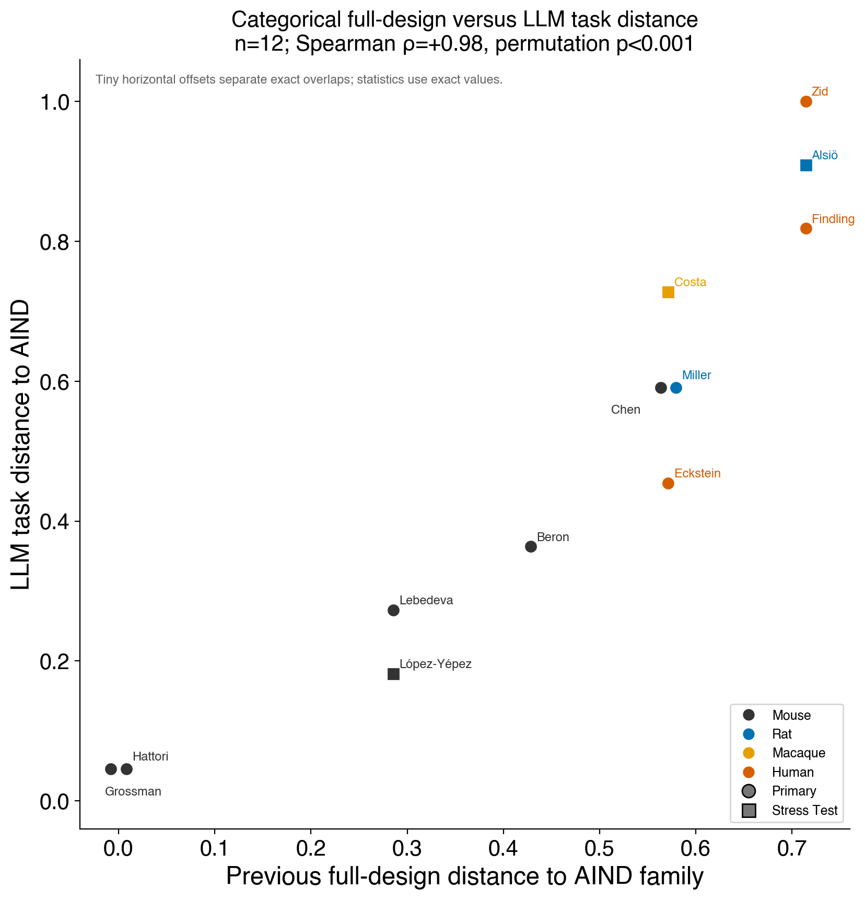
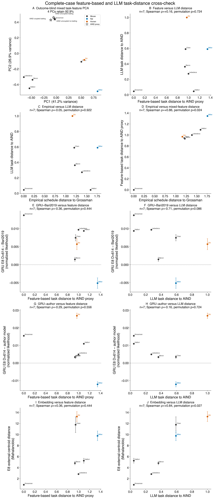

# Result 6 — prompt-blinded LLM task distance to AIND

This result asks whether an outcome-hidden-prompt language-model task distance to the AIND
task family explains external E8 GRU transfer or embedding displacement.

<!-- BEGIN result-6 -->
[regenerated by `analysis/report_llm_task_similarity.py` — do not edit by hand]

[Editable SVG](../fig_llm_task_similarity.svg)

## Frozen judge protocol

The judge saw 12 opaque task cards and the three AIND source-task prototypes. Every actor was called **subject**: species, study and author names, cohort size, GRU results, embeddings, and the hand-coded distance were absent. Response and reward apparatus remained visible as secondary task features. The frozen ordinal output implies all 66 unordered pairwise outcomes. Each was encoded in both A/B directions as an invariance audit, not as an independent model call.

This is an exploratory **single-Codex-judge sensitivity analysis**. The pair rank therefore has no sampling-error bar. An independent multi-model replication would be required before treating this as a primary covariate. Because the judge ran in the existing analysis session, the blinding is at the prompt-card level, not an isolated-context guarantee. The visible performance and embedding error bars are SEM across three source seeds.

## Ranking

| rank | study | tier | LLM task distance to AIND |
|---:|---|---|---:|
| 1 | Grossman (mouse) | primary | 0.045 |
| 2 | Hattori (mouse) | primary | 0.045 |
| 3 | López-Yépez (mouse) | stress test | 0.182 |
| 4 | Lebedeva (mouse) | primary | 0.273 |
| 5 | Beron (mouse) | primary | 0.364 |
| 6 | Eckstein (human) | primary | 0.455 |
| 7 | Chen (mouse) | primary | 0.591 |
| 8 | Miller (rat) | primary | 0.591 |
| 9 | Costa (macaque) | stress test | 0.727 |
| 10 | Findling (human) | primary | 0.818 |
| 11 | Alsiö (rat) | stress test | 0.909 |
| 12 | Zid (human) | primary | 1.000 |

The three closest judged tasks are Grossman (mouse), Hattori (mouse), López-Yépez (mouse); the three most distant are Findling (human), Alsiö (rat), Zid (human).

## Association with E8 transfer

Across all 12 valid cohorts, LLM task distance to AIND versus GRU−Bari2019 normalized-likelihood advantage has Spearman ρ=-0.611 (permutation p=0.0391). Among the 11 cohorts with an author-model reference, the GRU−author association is ρ=+0.100 (p=0.7699).

LLM task distance to AIND versus E8 embedding-centroid distance has Spearman ρ=+0.449 (permutation p=0.1454). Species colors are added only after unblinding and are descriptive; species was not available to the judge.

## Consistency with the previous full-design distance

[Editable SVG](../fig_full_design_vs_llm_task_distance.svg)

This comparison includes all 12 valid cohorts. The previous full-design score is the seven-axis categorical distance to the nearest AIND task prototype; the LLM distance is the frozen outcome-blind pairwise rank. They agree at Spearman ρ=+0.975 (permutation p=0.0000; leave-one-cohort-out range [+0.97, +0.98]).

## Complete-case mixed-feature cross-check

[Editable SVG](../fig_task_distance_crosscheck.svg)

This outcome-blind cross-check uses the seven cohorts whose canonical adapters expose complete trial-wise arm probabilities: Grossman (mouse), Chen (mouse), Zid (human), Lebedeva (mouse), Beron (mouse), Miller (rat), and Hattori (mouse). It combines seven categorical task/apparatus axes with seven empirical schedule metrics. Categorical axes are one-hot encoded, empirical metrics are standardized using the frozen seven-cohort population moments, and the two feature blocks each receive one-half total weight. PCA is fit without outcomes, embeddings, or species. The first 4 PCs explain 92.9% of feature variance.

The three AIND categorical prototypes are exact, but their empirical coordinates are provisionally anchored to Grossman (mouse), because empirical schedule summaries stratified by the three AIND source curricula have not yet been frozen. Accordingly, this is a **feature-based distance to an AIND proxy**, not a final objective AIND-family distance.

| study | feature distance to AIND proxy | LLM task distance to AIND | empirical distance to Grossman | nearest AIND proxy |
|---|---:|---:|---:|---|
| Grossman (mouse) | 0.000 | 0.045 | 0.000 | uncoupled no baiting |
| Chen (mouse) | 0.945 | 0.591 | 1.203 | uncoupled no baiting |
| Zid (human) | 0.968 | 1.000 | 1.159 | uncoupled no baiting |
| Lebedeva (mouse) | 0.998 | 0.273 | 1.387 | coupled baiting |
| Beron (mouse) | 0.933 | 0.364 | 1.217 | coupled baiting |
| Miller (rat) | 1.345 | 0.591 | 1.759 | uncoupled no baiting |
| Hattori (mouse) | 1.095 | 0.045 | 1.593 | coupled baiting |

| complete-case relationship | n | Spearman ρ | exact p | leave-one-cohort-out ρ |
|---|---:|---:|---:|---:|
| Feature distance vs LLM distance | 7 | +0.164 | 0.7238 | [-0.20, +0.46] |
| Empirical Grossman distance vs LLM distance | 7 | -0.055 | 0.9222 | [-0.55, +0.21] |
| Feature distance vs empirical Grossman distance | 7 | +0.857 | 0.0238 | [+0.77, +0.94] |
| GRU−Bari2019 vs feature distance | 7 | -0.357 | 0.4444 | [-0.54, +0.03] |
| GRU−Bari2019 vs LLM distance | 7 | -0.709 | 0.0857 | [-0.79, -0.58] |
| GRU−author vs feature distance | 7 | -0.286 | 0.5560 | [-0.49, +0.14] |
| GRU−author vs LLM distance | 7 | -0.164 | 0.7238 | [-0.88, +0.00] |
| Embedding distance vs feature distance | 7 | +0.357 | 0.4444 | [-0.03, +0.54] |
| Embedding distance vs LLM distance | 7 | +0.837 | 0.0270 | [+0.74, +0.99] |

Feature-based distance and LLM task distance agree at ρ=+0.164 (exact p=0.7238). By contrast, the empirical schedule-only distance to Grossman (mouse) relates to LLM task distance at ρ=-0.055 (exact p=0.9222). This contrast tests whether the LLM primarily tracks the categorical task description rather than the realized reward-probability dynamics.

The mixed feature distance itself closely tracks the empirical Grossman-centered distance (ρ=+0.857, exact p=0.0238); its leading PCs are dominated by reward-schedule statistics despite equal block weighting. Hattori (mouse) is the clearest disagreement: the LLM places its coupled-baiting task close to the AIND family, while the provisional feature geometry penalizes its empirical schedule relative to the Grossman (mouse) anchor. The retained-PC and all-PC feature-distance rankings are identical (ρ=+1.000), so this conclusion is not caused by the 90%-variance truncation.

Within these seven cohorts, embedding displacement relates more strongly to LLM task distance (ρ=+0.837, exact p=0.0270) than to the feature-based proxy (ρ=+0.357, exact p=0.4444). This is exploratory at n=7 and should not be interpreted as a formal difference between correlations.
<!-- END result-6 -->

## Interpretation boundary

This result is a sensitivity analysis. It does not replace empirical schedule features,
and the initial single-judge rank should be replicated with independent model calls before
being promoted to a primary explanatory variable.
