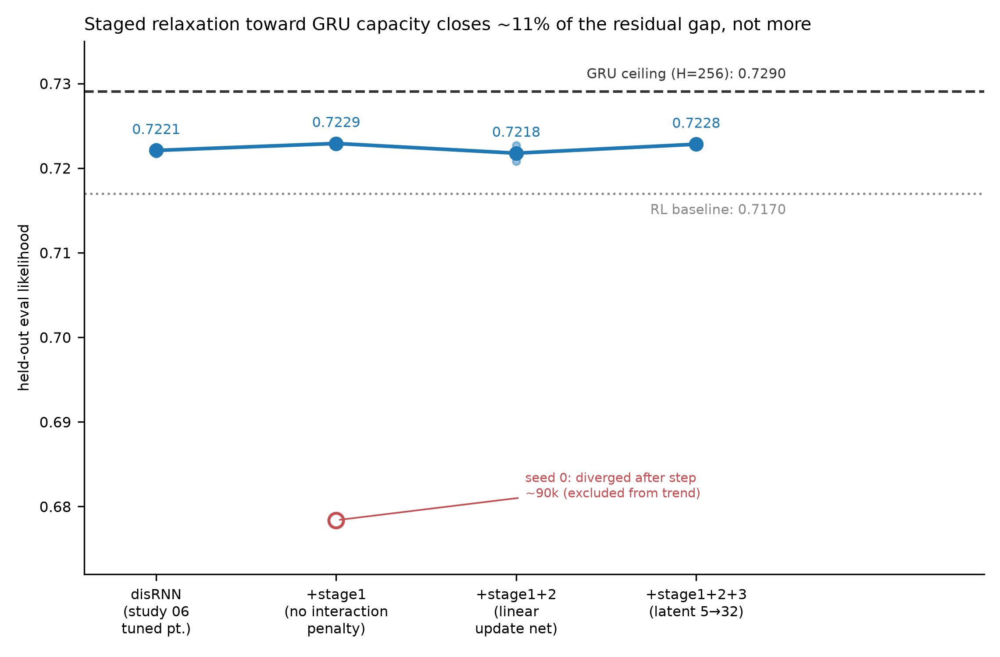

# r1 — Staged attribution of the residual GRU gap

**Question.** Study 06's tuned disRNN operating point (`mult=1`, `beta=3e-4`, `latent_size=5`,
D=614, n_steps=100000) closes about half the GRU gap but doesn't eliminate it. Zeroing the
interaction-bottleneck penalty, linearizing the update net, and widening the latent — each one
relaxation closer to a GRU-shaped function — should attribute how much of that residual gap is
disRNN's capacity/regularization design versus something else in the architecture.

## ⚠️ Before the numbers: two things had to be re-verified, and both moved the answer

**1. The published "GRU ceiling" (0.7268) is stale.** Study 06's `analysis/scaling_report.py`
hardcodes `GRU = {..., 614: 0.7268}`. Re-pulling study 01's actual GRU H=256, D=614 runs from
W&B (`nxd-grid@20260623-102649`, 3 seeds, all `state=="finished"`, all early-stopped at step
90505) gives **0.7290** (seeds 0.72910/0.72896/0.72901 — SD < 0.0001, tight agreement). This
number is also what `nxd_scaling.json` (study 01's own committed data, produced 2026-09-01,
*after* the 0.7268 constant was hardcoded into study 06's script) reports. The 0.7268 constant
was never refreshed after study 01 re-ran/extended its H=256 column. **This report uses the
freshly verified 0.7290**, which revises study 06's headline residual gap from the commonly
quoted **-0.0047** to **-0.0069** (`0.7290 - 0.7221`). Every number below is computed against
this corrected baseline; study 06's own README/reports still show the old, stale figure and
should eventually be corrected too, but that is out of scope for this study's closing analysis.

**2. `stage1-no-penalty` seed 0 diverged late in training and is excluded from all summary
statistics.** Its `checkpoint/eval_likelihood` step curve tracks the healthy seed almost exactly
through step 87500 (0.7307 vs. 0.7295) then collapses to 0.6811 by step 97500 and stays there —
a late-training instability, not a data-pull artifact (both `checkpoint/eval_likelihood` and
`heldout/final/eval_likelihood` collapsed together, consistent with a bad final checkpoint feeding
the held-out fine-tune). Averaging it in would report `stage1-no-penalty`'s mean as 0.7006 — a
**24σ**-scale outlier relative to every other seed in this study (seed SD elsewhere ≈0.0004-0.0013)
that would make the interaction-penalty relaxation look like it *widens* the gap by 4x. It is
excluded from the trend line and shown separately in the figure (an open red marker), per the
rule that an excluded row never enters a plotted summary.

## Verified numbers

| quantity | value | source |
|---|---|---|
| study06 tuned point (D=614, mult=1, β=3e-4, n_steps=100000) | seed0=0.72247, seed1=0.72170, **mean=0.72208** | `disrnn_data_scaling` / `mult-d-grid@20260718-151409` |
| GRU ceiling (H=256, D=614) | 0.72910/0.72896/0.72901, **mean=0.72902** | `mice_data_scaling` / `nxd-grid@20260623-102649` |
| baseline residual gap | **-0.00694** | GRU − study06 tuned |
| stage1-no-penalty | seed0=**0.67838 (COLLAPSED, excluded)**, seed1=0.72291 | `disrnn_near_gru_ceiling` / `stage1-no-penalty@20260909-021133` |
| stage2-linear-update-net | seed0=0.72083, seed1=0.72269, mean=**0.72176** | `disrnn_near_gru_ceiling` / `stage2-linear-update-net@20260909-021223` |
| stage3-wide-latent (latent=32) | seed0=0.72251, seed1=0.72313, mean=**0.72282** | `disrnn_near_gru_ceiling` / `stage3-wide-latent@20260909-140640` |

## Gap-closure attribution

| stage (cumulative) | mean held-out LL | remaining gap to GRU | gap closed vs. baseline | % of baseline gap closed |
|---|---|---|---|---|
| disRNN tuned (study 06, baseline) | 0.7221 | -0.0069 | — | 0% |
| +stage1 (interaction penalty → 0)ᵃ | 0.7229 | -0.0061 | +0.0008 | **+11.9%** |
| +stage1+2 (+ linear update net) | 0.7218 | -0.0073 | -0.0003 | **-4.6%** |
| +stage1+2+3 (+ latent 5→32) | 0.7228 | -0.0062 | +0.0007 | **+10.6%** |

ᵃ stage1's single reliable seed (seed 1); seed 0 collapsed and is excluded (see above).

**Verdict: at most ~11% of the residual gap closes, and it does not close monotonically.**
Zeroing the interaction penalty alone (stage 1) recovers essentially all of the closure this
ablation ever achieves. Adding the update-net linearity (stage 2) does not extend it further —
the stage1+2 mean (0.7218) is *below* stage 1's healthy seed and statistically indistinguishable
from the study-06 baseline itself (a 0.0003 difference against a between-seed spread of
0.0009-0.0019 in this study, and ≈0.0005 in study 06). Widening the latent from 5 to 32 (stage 3)
recovers the closure back to roughly stage 1's level (10.6% vs. 11.9%) but does not exceed it.
**None of the three stages, individually or cumulatively, comes close to eliminating the -0.0069
gap** — at latent_size=32, ~89% of the residual gap remains.

**This cannot rule out that GRU-matched capacity (latent_size=256) would close much more.**
Stage 3 as executed is a **downgraded, reduced ceiling probe** at latent_size=32 (a 6.4x widening
from the baseline's 5, but only 1/8 of the H=256 target) — see the study README's downgrade note.
The flat, small effect observed from a 6.4x latent widening is at least *consistent with*
capacity/regularization not being the dominant remaining bottleneck at this scale, but the study
cannot distinguish that from "the effect only shows up much closer to latent_size=256." True
GRU-parity capacity requires the wrapper's `update_latents` `vmap` fix
([wrapper#99](https://github.com/AllenNeuralDynamics/aind-dynamic-foraging-bfm-wrapper/issues/99)).

## Generalization gap (checkpoint/eval_likelihood − heldout/final/eval_likelihood)

| stage | seed0 gap | seed1 gap | mean |
|---|---|---|---|
| study06 tuned (baseline) | 0.0067 | 0.0071 | 0.0069 |
| stage1-no-penalty | 0.0044 (collapsed run, not meaningful) | 0.0063 | — (use seed1: 0.0063) |
| stage2-linear-update-net | 0.0073 | 0.0059 | 0.0066 |
| stage3-wide-latent | 0.0060 | 0.0065 | 0.0063 |

All four settings' generalization gaps sit in a tight 0.0059-0.0073 band (0.0063-0.0069 using
only healthy runs). **Relaxing disRNN's penalty, nonlinearity, and width toward a GRU-shaped
function does not measurably change the train/held-out generalization gap at this scale** — the
small held-out gains in the table above come from the model fitting and transferring slightly
better overall, not from suppressing overfitting relative to the tuned disRNN baseline. This
mirrors study 06 r2's own finding that the generalization gap is flat across its penalty×D
surface at D=614.

## Caveats

- **Stage 2 and stage 3's configurations are not interpretable disentangled RNNs.** See the study
  README's caveat — these results characterize a capacity ceiling, not a candidate operating
  point, and must not be folded into study 06's verdict.
- **Stage 3 is latent_size=32, not the originally planned latent_size=256** (see study README
  downgrade note and `variants/stage3-wide-latent/notes.md` for the full OOM/argument-packing
  diagnostic). Any claim about "how close disRNN can get to GRU capacity" is bounded by this —
  the study answers "at latent_size=32," not at GRU-matched capacity.
- **stage1-no-penalty is effectively n=1** after excluding the collapsed seed. A third seed would
  materially strengthen this stage's estimate; none was launched.
- **The corrected GRU_CEIL (0.7290) is not yet reflected in study 06's own committed reports**
  (`analysis/scaling_report.py`'s hardcoded `GRU` dict, and the prose in `r2-scaling-surface.md`
  quoting "-0.0047"/"0.7268"). This is a pre-existing staleness in study 06, surfaced by this
  study's independent re-verification; fixing study 06's own report is out of scope here.
