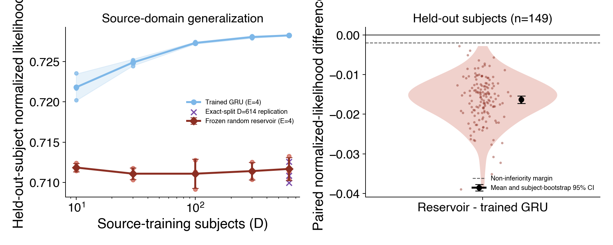

# Result 1 - frozen-random GRU reservoir

<!-- BEGIN result-1 -->

| nominal D | realized D by seed | trained GRU | frozen reservoir | reservoir − trained |
|---:|---|---:|---:|---:|
| 10 | 10, 10, 10 | 0.721793 | 0.711852 | -0.009942 |
| 30 | 29, 30, 30 | 0.724873 | 0.711091 | -0.013782 |
| 100 | 99, 101, 101 | 0.727291 | 0.711088 | -0.016203 |
| 300 | 300, 301, 300 | 0.728024 | 0.711413 | -0.016611 |
| 614 | 614, 614, 614 | 0.728229 | 0.711680 | -0.016549 |

| D=614 comparison | mean normalized likelihood | SD across seeds |
|---|---:|---:|
| Trained GRU (H=128, D=614, E=4) | 0.728229 | 0.000063 |
| Frozen reservoir, exact split (H=128, D=614, E=4) | 0.711126 | 0.001322 |

Across 149 paired held-out subjects, reservoir minus trained-GRU likelihood is
**-0.016328** on average (subject-bootstrap 95% CI
**[-0.017289, -0.015381]**). The predeclared lower-bound
criterion is greater than -0.002; therefore the reservoir is
**not non-inferior** in this first-pass source-domain test.

All 15 scaling-curve runs passed the bitwise audit: every frozen GRU and
session-conditioning parameter equals its initialized value, while source subject
embeddings and the readout changed. The D=614 curve cell uses the accepted
three-subject-drift pilot; its exact-split replication is shown separately and is
not counted as three additional independent seeds. Held-out subject keys match the
paired trained-GRU runs for all exact-split D=614 seeds.
<!-- END result-1 -->

## Interpretation boundary

This first pass tests sufficiency in the source domain only. A competitive
reservoir would show that trained recurrent dynamics are not necessary for this
particular held-out-subject result; it would not establish that learned dynamics
are irrelevant to external-task transfer or richer behavioral targets.
